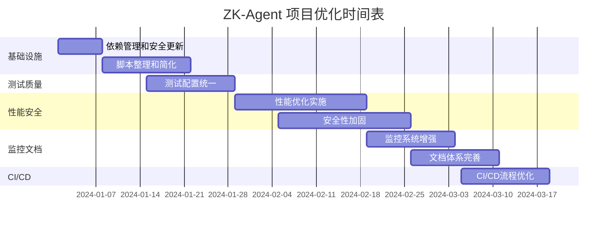

# ZK-Agent 项目详细工作技术计划

## 项目概述

基于当前项目状态分析和优化建议，制定系统性的技术改进计划。项目当前拥有85+个npm脚本、复杂的依赖关系和多个配置文件，需要进行全面的技术债务清理和架构优化。

## 总体目标

- 提升代码质量和可维护性
- 优化项目性能和安全性
- 简化开发流程和配置管理
- 建立完善的监控和文档体系

## 详细任务计划

### 阶段一：基础设施优化 (第1-4周)

#### 任务1: 依赖管理和安全更新 (task-343)
**优先级**: 高 | **预估工时**: 8小时 | **负责人**: 开发团队

**具体行动项**:
1. **依赖审计**
   - 运行 `npm audit` 检查安全漏洞
   - 使用 `npm outdated` 识别过时依赖
   - 分析 `package.json` 中的重复和冲突依赖

2. **安全更新**
   - 修复所有高危和中危安全漏洞
   - 更新关键依赖到最新稳定版本
   - 配置 `npm audit fix` 自动修复

3. **版本管理统一**
   - 建立 `.nvmrc` 文件锁定Node.js版本
   - 配置 `package-lock.json` 确保依赖一致性
   - 设置依赖更新策略和流程

**验收标准**:
- [ ] 无高危安全漏洞
- [ ] 所有依赖版本兼容
- [ ] 构建和测试正常运行

#### 任务2: 脚本整理和简化 (task-344)
**优先级**: 高 | **预估工时**: 12小时 | **负责人**: 架构师

**具体行动项**:
1. **脚本分类整理**
   - 将85+个脚本按功能分类（开发、构建、测试、部署等）
   - 识别重复和冗余脚本
   - 合并相似功能的脚本

2. **核心脚本定义**
   ```json
   {
     "scripts": {
       "dev": "开发服务器启动",
       "build": "生产构建",
       "test": "运行所有测试",
       "test:unit": "单元测试",
       "test:e2e": "端到端测试",
       "lint": "代码检查",
       "format": "代码格式化",
       "deploy": "部署到生产环境",
       "db:migrate": "数据库迁移",
       "security:audit": "安全审计"
     }
   }
   ```

3. **脚本文档化**
   - 为每个脚本添加清晰的描述
   - 创建脚本使用指南
   - 建立脚本命名规范

**验收标准**:
- [ ] 脚本数量减少到20个以内
- [ ] 所有脚本功能明确且无重复
- [ ] 完整的脚本文档

### 阶段二：测试和质量保证 (第3-6周)

#### 任务3: 测试配置统一 (task-345)
**优先级**: 中 | **预估工时**: 16小时 | **负责人**: QA团队

**具体行动项**:
1. **Jest配置整合**
   - 合并多个Jest配置文件为统一配置
   - 建立测试环境标准化
   - 配置代码覆盖率报告

2. **测试框架统一**
   ```javascript
   // jest.config.js
   module.exports = {
     preset: 'ts-jest',
     testEnvironment: 'node',
     collectCoverageFrom: [
       'src/**/*.{ts,tsx}',
       '!src/**/*.d.ts'
     ],
     coverageThreshold: {
       global: {
         branches: 80,
         functions: 80,
         lines: 80,
         statements: 80
       }
     }
   };
   ```

3. **测试策略制定**
   - 单元测试覆盖率目标: 80%+
   - 集成测试关键业务流程
   - E2E测试核心用户场景

**验收标准**:
- [ ] 统一的测试配置
- [ ] 代码覆盖率达到80%
- [ ] 所有测试正常运行

### 阶段三：性能和安全优化 (第5-10周)

#### 任务4: 性能优化实施 (task-346)
**优先级**: 中 | **预估工时**: 20小时 | **负责人**: 前端团队

**具体行动项**:
1. **Bundle分析优化**
   - 使用 `webpack-bundle-analyzer` 分析包大小
   - 实施代码分割和懒加载
   - 优化第三方库引入

2. **资源优化**
   - 图片压缩和WebP格式转换
   - CSS和JS文件压缩
   - 启用Gzip压缩

3. **缓存策略**
   - 配置浏览器缓存策略
   - 实施Service Worker缓存
   - CDN资源优化

**性能目标**:
- [ ] 首屏加载时间 < 3秒
- [ ] Bundle大小减少30%
- [ ] Lighthouse性能评分 > 90

#### 任务5: 安全性加固 (task-347)
**优先级**: 高 | **预估工时**: 24小时 | **负责人**: 安全团队

**具体行动项**:
1. **环境变量安全化**
   - 敏感信息加密存储
   - 实施密钥轮换机制
   - 配置环境隔离

2. **安全策略配置**
   ```javascript
   // 内容安全策略
   const cspConfig = {
     directives: {
       defaultSrc: ["'self'"],
       scriptSrc: ["'self'", "'unsafe-inline'"],
       styleSrc: ["'self'", "'unsafe-inline'"],
       imgSrc: ["'self'", "data:", "https:"]
     }
   };
   ```

3. **输入验证和防护**
   - 实施输入验证和清理
   - 配置CSRF防护
   - 添加XSS防护机制

**验收标准**:
- [ ] 通过安全扫描测试
- [ ] 所有敏感数据加密
- [ ] 安全策略完整配置

### 阶段四：监控和文档完善 (第8-12周)

#### 任务6: 监控系统增强 (task-348)
**优先级**: 中 | **预估工时**: 18小时 | **负责人**: 运维团队

**具体行动项**:
1. **性能监控**
   - 集成APM工具（如New Relic或DataDog）
   - 配置关键指标监控
   - 建立性能基线和告警

2. **错误追踪**
   - 集成Sentry错误监控
   - 配置错误分类和优先级
   - 建立错误处理流程

3. **日志系统**
   - 统一日志格式和级别
   - 配置日志聚合和分析
   - 建立日志保留策略

**验收标准**:
- [ ] 完整的监控仪表板
- [ ] 实时错误告警
- [ ] 结构化日志系统

#### 任务7: 文档体系完善 (task-349)
**优先级**: 低 | **预估工时**: 14小时 | **负责人**: 技术写作团队

**具体行动项**:
1. **API文档更新**
   - 使用Swagger/OpenAPI规范
   - 自动化API文档生成
   - 添加使用示例和测试

2. **架构文档**
   - 系统架构图和说明
   - 数据流图和时序图
   - 技术决策记录(ADR)

3. **开发规范**
   - 代码风格指南
   - Git工作流规范
   - 发布流程文档

**验收标准**:
- [ ] 完整的API文档
- [ ] 清晰的架构文档
- [ ] 标准化开发规范

### 阶段五：CI/CD优化 (第10-12周)

#### 任务8: CI/CD流程优化 (task-350)
**优先级**: 中 | **预估工时**: 16小时 | **负责人**: DevOps团队

**具体行动项**:
1. **构建流程优化**
   - 并行化构建步骤
   - 缓存依赖和构建产物
   - 优化Docker镜像大小

2. **自动化测试集成**
   - 单元测试自动运行
   - 集成测试和E2E测试
   - 代码质量门禁

3. **部署流程改进**
   - 蓝绿部署或滚动更新
   - 自动回滚机制
   - 环境一致性保证

**验收标准**:
- [ ] 构建时间减少50%
- [ ] 自动化测试覆盖率100%
- [ ] 零停机部署

## 实施时间表



## 风险评估和缓解策略

### 高风险项
1. **依赖更新风险**
   - 风险: 依赖更新可能导致兼容性问题
   - 缓解: 分阶段更新，充分测试，保留回滚方案

2. **脚本简化风险**
   - 风险: 删除脚本可能影响现有工作流
   - 缓解: 详细记录现有脚本用途，逐步迁移

### 中风险项
1. **性能优化风险**
   - 风险: 优化可能引入新的bug
   - 缓解: 性能测试和监控，渐进式优化

2. **安全配置风险**
   - 风险: 安全策略过严可能影响功能
   - 缓解: 分环境测试，逐步收紧策略

## 成功指标

### 技术指标
- [ ] 构建时间减少50%
- [ ] 测试覆盖率达到80%+
- [ ] 安全漏洞数量为0
- [ ] 性能评分提升到90+
- [ ] 脚本数量减少到20个以内

### 质量指标
- [ ] 代码重复率 < 5%
- [ ] 技术债务评级提升
- [ ] 开发效率提升30%
- [ ] 部署频率提升50%
- [ ] 故障恢复时间减少60%

## 资源需求

### 人力资源
- 架构师: 40小时
- 前端开发: 32小时
- 后端开发: 28小时
- QA工程师: 24小时
- DevOps工程师: 20小时
- 安全工程师: 16小时

### 工具和服务
- 监控工具许可证
- 安全扫描工具
- 性能测试工具
- 文档平台订阅

## 后续维护计划

1. **月度评估**: 每月评估优化效果和指标达成情况
2. **季度更新**: 每季度更新依赖和安全补丁
3. **年度审查**: 年度技术栈和架构审查
4. **持续改进**: 建立技术债务管理流程

## 结论

本工作计划基于项目当前状态的深度分析，采用分阶段、渐进式的优化策略。通过系统性的技术改进，预期将显著提升项目的质量、性能、安全性和可维护性。计划实施过程中需要密切监控风险，确保每个阶段的成功完成。

---

**文档版本**: v1.0  
**创建日期**: 2024-01-01  
**最后更新**: 2024-01-01  
**负责人**: 技术团队  
**审核人**: 项目经理、架构师