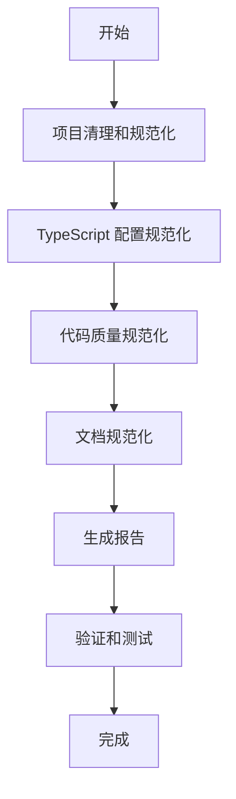

# ZK-Agent 项目规范化执行指南

> 本指南提供了完整的项目架构规范化流程，确保代码质量、架构一致性和文档规范性。

## 📋 目录

- [概述](#概述)
- [执行前准备](#执行前准备)
- [规范化流程](#规范化流程)
- [脚本说明](#脚本说明)
- [执行步骤](#执行步骤)
- [验证和测试](#验证和测试)
- [常见问题](#常见问题)
- [维护指南](#维护指南)

## 🎯 概述

本项目规范化方案旨在解决以下问题：

### 🔍 发现的问题
- **前端架构不统一**：同时存在 `app/`、`frontend/src/`、`src/`、`components/` 多个前端目录
- **代码重复**：发现重复的组件和功能实现
- **配置不一致**：TypeScript 配置和路径映射不统一
- **文档冗余**：存在重复和过时的文档
- **代码质量**：缺乏统一的代码格式和质量标准

### 🎯 解决方案
- 统一前端架构为 Next.js App Router (`app/` 目录)
- 清理重复组件和冗余目录
- 标准化 TypeScript 配置和路径映射
- 规范化文档结构和内容
- 建立代码质量检查和自动修复机制

## 🛠️ 执行前准备

### 1. 环境要求
- Windows 操作系统
- PowerShell 5.1 或更高版本
- Node.js 和 npm
- Git（用于版本控制）

### 2. 备份重要数据
```powershell
# 创建项目备份
git add .
git commit -m "backup: 规范化前的项目状态"
git tag "pre-standardization-$(Get-Date -Format 'yyyyMMdd-HHmmss')"
```

### 3. 检查项目状态
```powershell
# 确保没有未提交的重要更改
git status

# 确保依赖已安装
npm install
```

## 🚀 规范化流程

### 流程概览



### 执行顺序
1. **项目清理和规范化** - 清理冗余目录和重复文件
2. **TypeScript 配置规范化** - 统一配置和路径映射
3. **代码质量规范化** - 检查和修复代码质量问题
4. **文档规范化** - 整理文档结构和内容

## 📜 脚本说明

### 1. 主执行脚本
**文件：** `scripts/master-standardization.ps1`
**功能：** 整合所有规范化流程的主脚本
**特点：**
- 自动执行所有规范化步骤
- 生成详细的执行报告
- 提供错误处理和回滚建议
- 创建统一的报告目录

### 2. 项目清理脚本
**文件：** `scripts/project-cleanup-and-standardization.ps1`
**功能：** 清理冗余目录和重复文件
**主要任务：**
- 备份重要文件和目录
- 分析代码重复和冗余
- 清理空目录和临时文件
- 检测重复组件
- 生成迁移建议

### 3. TypeScript 配置脚本
**文件：** `scripts/typescript-config-standardization.ps1`
**功能：** 统一 TypeScript 配置
**主要任务：**
- 创建标准化的 tsconfig.json
- 配置路径映射 (@/* 别名)
- 创建开发、生产、测试环境配置
- 验证配置有效性

### 4. 代码质量脚本
**文件：** `scripts/code-quality-standardization.ps1`
**功能：** 检查和修复代码质量
**主要任务：**
- 运行 ESLint 和 Prettier 检查
- 自动修复格式问题
- 检查导入路径规范
- 检测重复组件
- 查找未使用的文件

### 5. 文档规范化脚本
**文件：** `scripts/documentation-standardization.ps1`
**功能：** 整理文档结构
**主要任务：**
- 分析现有文档结构
- 检测重复和冗余文档
- 创建文档索引
- 整理根目录文档
- 创建文档模板

## 📋 执行步骤

### 方式一：一键执行（推荐）

```powershell
# 进入项目根目录
cd e:\zk-agent

# 执行主规范化脚本
.\scripts\master-standardization.ps1
```

### 方式二：分步执行

```powershell
# 1. 项目清理
.\scripts\project-cleanup-and-standardization.ps1

# 2. TypeScript 配置
.\scripts\typescript-config-standardization.ps1

# 3. 代码质量检查
.\scripts\code-quality-standardization.ps1

# 4. 文档规范化
.\scripts\documentation-standardization.ps1
```

### 执行权限设置

如果遇到执行策略问题：

```powershell
# 临时允许脚本执行
Set-ExecutionPolicy -ExecutionPolicy RemoteSigned -Scope CurrentUser

# 或者绕过执行策略
PowerShell -ExecutionPolicy Bypass -File .\scripts\master-standardization.ps1
```

## 📊 报告和输出

### 生成的报告
执行完成后，会在 `standardization-reports-{timestamp}` 目录中生成：

- **STANDARDIZATION_SUMMARY.md** - 可读的摘要报告
- **master-standardization-report.json** - 详细的 JSON 报告
- **各步骤的详细报告** - 每个脚本的执行报告

### 生成的文件
- **配置文件**：`tsconfig.json`、`tsconfig.dev.json`、`tsconfig.prod.json`、`tsconfig.test.json`
- **文档文件**：`DOCUMENTATION_INDEX.md`、`docs/DOCUMENT_TEMPLATE.md`
- **架构标准**：`docs/PROJECT_ARCHITECTURE_STANDARDS.md`
- **备份目录**：包含所有重要文件的备份

## ✅ 验证和测试

### 1. 基本验证
```powershell
# 检查 TypeScript 配置
npm run type-check

# 检查代码质量
npm run lint

# 格式化代码
npm run format
```

### 2. 功能测试
```powershell
# 运行单元测试
npm run test

# 运行集成测试
npm run test:integration

# 构建项目
npm run build
```

### 3. 开发服务器测试
```powershell
# 启动开发服务器
npm run dev

# 访问 http://localhost:3000 验证功能
```

## ❓ 常见问题

### Q1: 脚本执行失败怎么办？
**A:** 
1. 检查 PowerShell 执行策略
2. 确保有足够的文件系统权限
3. 查看详细错误信息
4. 使用备份文件恢复

### Q2: 发现重要文件被误删？
**A:**
1. 检查备份目录
2. 使用 Git 恢复：`git checkout HEAD -- <文件路径>`
3. 从报告中查找文件位置

### Q3: TypeScript 配置验证失败？
**A:**
1. 检查路径映射是否正确
2. 确保所有依赖已安装
3. 手动调整 tsconfig.json 配置

### Q4: 代码格式检查失败？
**A:**
1. 运行 `npm run format` 自动修复
2. 手动修复 ESLint 报告的问题
3. 检查 .eslintrc 和 .prettierrc 配置

## 🔧 维护指南

### 定期维护任务

#### 每周
- 运行代码质量检查
- 更新文档索引
- 清理临时文件

#### 每月
- 重新运行完整规范化流程
- 检查新的重复代码
- 更新配置文件

#### 每季度
- 评估架构标准
- 更新规范化脚本
- 培训团队成员

### 持续改进

1. **监控指标**
   - 代码重复率
   - 测试覆盖率
   - 构建时间
   - 文档完整性

2. **工具集成**
   - 配置 Git hooks
   - 集成 CI/CD 流水线
   - 设置自动化检查

3. **团队协作**
   - 建立代码审查流程
   - 制定编码规范
   - 定期技术分享

## 📚 相关文档

- [项目架构标准](docs/PROJECT_ARCHITECTURE_STANDARDS.md)
- [文档索引](DOCUMENTATION_INDEX.md)
- [API 设计规范](docs/api/api-design-specification.md)
- [组件设计规范](docs/frontend/component-design-specification.md)

## 🆘 支持和帮助

如果在执行过程中遇到问题：

1. **查看报告**：检查生成的详细报告
2. **检查日志**：查看脚本输出的错误信息
3. **使用备份**：从备份目录恢复重要文件
4. **手动修复**：根据报告建议手动处理问题

---

*最后更新: 2025-01-24*
*维护者: ZK-Agent 开发团队*