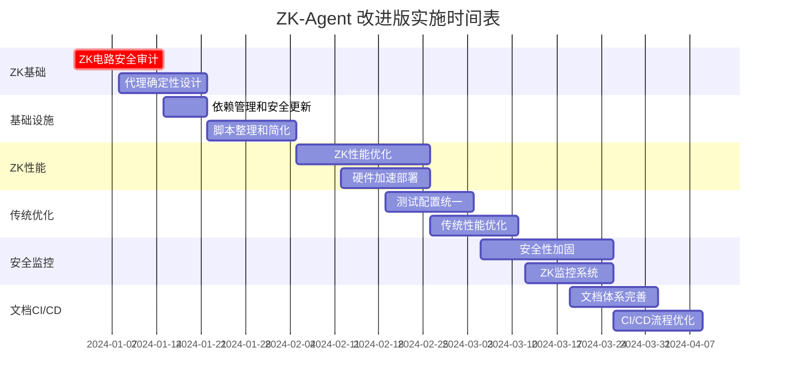

# ZK-Agent 项目工作计划改进建议

## AI导师专业评估摘要

基于对ZK-Agent项目的深度分析，AI导师指出了原工作计划中需要特别关注的零知识证明(ZKP)和智能代理系统集成的关键挑战。以下是针对性的改进建议。

## 关键改进领域

### 1. ZK-特定安全考虑

#### 原计划不足
- 缺乏对ZK电路设计的专门考虑
- 未涉及证明生成的性能瓶颈
- 安全审计未包含ZK-特定漏洞

#### 改进措施
```markdown
**新增任务: ZK电路安全审计 (task-351)**
优先级: 极高 | 预估工时: 32小时

具体行动项:
1. 电路形式化验证
   - 使用Picus等工具验证电路逻辑
   - 对抗性测试(无效输入处理)
   - 算术溢出和边界条件检查

2. 侧信道攻击防护
   - 时间攻击防护分析
   - 功耗分析安全评估
   - 内存访问模式保护

3. 可信设置审计
   - 参数生成过程验证
   - 多方计算仪式审计
   - 定期参数更新机制
```

### 2. 代理系统确定性保证

#### 关键挑战
- 代理行为的非确定性可能破坏证明生成
- 浮点运算与ZK电路不兼容
- 代理决策的可验证性要求

#### 解决方案
```typescript
// 确定性代理设计模式
interface DeterministicAgent {
  // 使用固定点算术替代浮点
  computeDecision(input: FixedPointInput): FixedPointOutput;
  
  // 状态转换必须是纯函数
  stateTransition(currentState: AgentState, action: Action): AgentState;
  
  // 可证明的决策逻辑
  generateProof(decision: Decision): ZKProof;
}
```

### 3. 性能优化策略重新设计

#### 原计划调整
将性能优化任务分解为ZK-特定和传统Web优化两部分：

```markdown
**任务4A: ZK性能优化 (task-346a)**
优先级: 高 | 预估工时: 28小时

1. 证明生成优化
   - GPU/FPGA加速实施
   - 递归证明批处理
   - PLONK/STARK算法选择

2. 电路复杂度优化
   - 约束数量最小化
   - 查找表优化
   - 电路模块化设计

3. 验证效率提升
   - 批量验证实现
   - 预计算优化
   - 并行验证架构

**任务4B: 传统性能优化 (task-346b)**
优先级: 中 | 预估工时: 16小时

1. 前端Bundle优化
2. 缓存策略实施
3. CDN配置优化
```

### 4. 基础设施需求更新

#### 硬件加速基础设施
```yaml
# 新增基础设施需求
infrastructure:
  proving_cluster:
    gpu_nodes: 4x NVIDIA A100
    memory: 256GB per node
    storage: NVMe SSD 2TB
  
  verification_service:
    cpu_nodes: 8x Intel Xeon
    load_balancer: nginx
    auto_scaling: enabled
  
  monitoring:
    proof_latency: < 5s
    verification_throughput: > 1000 TPS
    circuit_compilation_time: < 30s
```

### 5. 团队技能要求调整

#### 新增专业角色
```markdown
**密码学专家** (40小时)
- ZK电路设计和优化
- 安全参数选择
- 形式化验证指导

**ZK系统架构师** (32小时)
- 证明系统架构设计
- 性能瓶颈分析
- 可扩展性规划

**代理系统工程师** (24小时)
- 确定性代理设计
- 状态管理优化
- 决策逻辑实现
```

### 6. 风险评估补充

#### ZK-特定风险
```markdown
**极高风险**
1. 电路漏洞风险
   - 影响: 系统安全性完全失效
   - 缓解: 多轮安全审计 + 形式化验证
   - 应急: 电路回滚机制

2. 证明生成性能风险
   - 影响: 系统不可用
   - 缓解: 硬件加速 + 算法优化
   - 应急: 降级到传统验证

**高风险**
3. 代理非确定性风险
   - 影响: 证明生成失败
   - 缓解: 严格的确定性设计
   - 应急: 状态回滚机制

4. 可信设置风险
   - 影响: 整个系统可信度
   - 缓解: 透明的多方仪式
   - 应急: 参数重新生成
```

### 7. 实施时间表调整



### 8. 成功指标更新

#### ZK-特定指标
```markdown
**技术指标**
- [ ] 证明生成时间 < 5秒
- [ ] 验证吞吐量 > 1000 TPS
- [ ] 电路约束数量优化30%
- [ ] 零安全漏洞(经第三方审计)
- [ ] 代理决策确定性100%

**性能指标**
- [ ] GPU利用率 > 80%
- [ ] 内存使用效率 > 90%
- [ ] 证明大小 < 1KB
- [ ] 验证时间 < 10ms
- [ ] 系统可用性 > 99.9%

**安全指标**
- [ ] 通过形式化验证
- [ ] 零侧信道攻击漏洞
- [ ] 可信设置透明度100%
- [ ] 密码学参数安全性验证
- [ ] 应急响应时间 < 1小时
```

### 9. 最小可行产品(MVP)策略

#### 阶段化实施
```markdown
**MVP Phase 1: 基础ZK-Agent原型** (4周)
- 单一代理决策证明
- 基础电路实现
- 简单验证机制

**MVP Phase 2: 性能优化** (6周)
- GPU加速集成
- 批量证明处理
- 监控系统基础

**MVP Phase 3: 生产就绪** (8周)
- 完整安全审计
- 高可用部署
- 完整监控和告警
```

### 10. 长期维护考虑

#### 后量子安全准备
```markdown
**后量子迁移计划**
1. STARK算法评估和准备
2. 抗量子密码学研究跟踪
3. 迁移路径设计和测试
4. 向后兼容性保证

**持续改进机制**
1. 月度性能基准测试
2. 季度安全审计
3. 年度密码学参数更新
4. 持续的电路优化
```

## 总结

基于AI导师的专业建议，改进后的工作计划更加注重ZK-Agent项目的特殊性质，特别是:

1. **安全优先**: 将ZK电路安全审计提升为最高优先级
2. **性能现实**: 认识到ZK证明的性能挑战，制定针对性优化策略
3. **确定性设计**: 确保代理系统与ZK证明系统的兼容性
4. **基础设施准备**: 提前规划硬件加速和专业团队需求
5. **风险管理**: 识别和缓解ZK-特定风险
6. **渐进实施**: 采用MVP方法降低项目风险

这些改进将显著提高项目成功的可能性，确保ZK-Agent系统既安全又高效。

---

**文档版本**: v1.0  
**基于**: DETAILED_WORK_PLAN.md v1.0  
**AI导师评估**: 已整合  
**创建日期**: 2024-01-01  
**负责人**: 技术团队 + 密码学专家