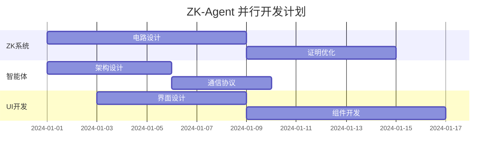

# ZK-Agent 工作计划关键改进建议

## 基于AI导师专业评估的改进方案

### 1. 代码变更影响分析强化

#### 1.1 可追溯性缺口修复

**当前问题**: 代码变更缺乏与具体需求的映射关系

**改进措施**:
- **需求映射矩阵**: 建立每个代码变更与业务需求的双向映射
- **向后兼容性检查**: 制定标准化的兼容性验证流程
- **模块影响分析**: 特别关注密码学原语和智能体逻辑的影响

**实施计划**:
```markdown
阶段1: 建立变更追溯系统 (2天)
- 创建变更影响分析模板
- 建立需求-代码映射数据库
- 制定向后兼容性检查清单

阶段2: 回归测试强化 (3天)
- 针对ZK电路的专项测试
- 智能体协调的混沌测试
- 性能基准测试自动化
```

#### 1.2 测试覆盖率量化指标

**ZK电路测试要求**:
- **约束覆盖率**: ≥95%的电路约束被测试覆盖
- **证明生成测试**: 每个电路至少100个有效/无效输入测试
- **性能基准**: 证明生成时间<2秒，验证时间<100ms

**智能体系统测试**:
- **并发测试**: 模拟10K+并发智能体
- **网络分区测试**: 验证智能体网络容错能力
- **故障级联测试**: 防止单点故障扩散

#### 1.3 依赖关系风险审计

**ZK库依赖管理**:
- **Circom**: 固定版本2.1.6，定期安全审计
- **Halo2**: 监控版本更新，评估证明健全性影响
- **snarkjs**: 验证可信设置的完整性

**版本控制策略**:
```json
{
  "zk-dependencies": {
    "circom": "=2.1.6",
    "halo2": "~0.3.0",
    "snarkjs": "=0.7.0"
  },
  "audit-schedule": "monthly",
  "security-scan": "weekly"
}
```

### 2. 可行性与优先级严格化

#### 2.1 研究债务管理

**高风险组件原型优先**:
1. **zk-SNARKs集成** (最高优先级)
   - 时间分配: 40%的开发时间
   - 风险缓解: 并行开发2个备选方案
   - 里程碑: 每周可演示的原型

2. **智能体协调机制** (高优先级)
   - 时间分配: 30%的开发时间
   - 风险缓解: 渐进式复杂度增加
   - 里程碑: 从2个智能体扩展到1000个

3. **用户界面优化** (中等优先级)
   - 时间分配: 20%的开发时间
   - 风险缓解: 使用成熟UI框架
   - 里程碑: 响应式设计完成

#### 2.2 MoSCoW方法应用

**Must-have (核心功能)**:
- ZK证明生成和验证
- 基础智能体通信
- 安全的密钥管理
- 基本的Web界面

**Should-have (重要功能)**:
- 智能体负载均衡
- 实时性能监控
- 用户认证系统
- API文档

**Could-have (增值功能)**:
- 高级UI动画
- 多语言支持
- 第三方集成
- 移动端适配

**Won't-have (暂不实现)**:
- 复杂的数据分析
- 社交功能
- 游戏化元素
- 区块链集成

#### 2.3 技能对齐评估

**团队技能矩阵**:
```markdown
| 技能领域 | 当前水平 | 需求水平 | 差距 | 培训计划 |
|---------|---------|---------|------|----------|
| ZK证明系统 | 初级 | 高级 | 大 | 3个月专项培训 |
| 智能体架构 | 中级 | 高级 | 中 | 1个月实战项目 |
| TypeScript | 高级 | 高级 | 无 | 持续学习 |
| 密码学 | 初级 | 中级 | 中 | 2个月理论学习 |
```

### 3. 风险评估完整性提升

#### 3.1 密码学盲点识别

**新增风险类别**:

**可信设置风险**:
- **风险**: 可信设置被破坏
- **影响**: 整个ZK系统安全性失效
- **缓解**: 使用通用可信设置，定期审计
- **监控**: 设置异常检测机制

**侧信道攻击风险**:
- **风险**: 通过时间/功耗分析泄露信息
- **影响**: 智能体私有数据泄露
- **缓解**: 实施常数时间算法
- **监控**: 定期安全渗透测试

**量子计算威胁**:
- **风险**: 量子计算机破解当前密码学
- **影响**: 长期安全性失效
- **缓解**: 研究后量子密码学方案
- **监控**: 跟踪量子计算发展

#### 3.2 运营风险扩展

**智能体网络分区**:
- **SLO**: 网络分区恢复时间<30秒
- **监控**: 实时网络拓扑监控
- **缓解**: 多路径冗余设计

**证明生成延迟**:
- **SLO**: 证明生成时间<2秒
- **监控**: 实时性能指标收集
- **缓解**: 动态负载均衡

#### 3.3 供应链风险管理

**ZK库依赖评估**:
```markdown
| 库名称 | 稳定性评级 | 维护状态 | 风险等级 | 缓解策略 |
|--------|-----------|----------|----------|----------|
| Circom | A | 活跃 | 低 | 定期更新 |
| Halo2 | B | 活跃 | 中 | 备选方案 |
| snarkjs | A | 活跃 | 低 | 版本锁定 |
```

### 4. 开发规范实用性增强

#### 4.1 自动化执行机制

**ZK电路规范**:
```javascript
// .circom-lintrc.js
module.exports = {
  rules: {
    'constraint-complexity': ['error', { max: 1000000 }],
    'signal-naming': ['error', 'camelCase'],
    'template-documentation': 'error'
  }
};
```

**智能体代码规范**:
```typescript
// agent-lint-rules.ts
export const agentRules = {
  'agent-determinism': 'error', // 确保智能体行为确定性
  'message-validation': 'error', // 消息格式验证
  'timeout-handling': 'error'   // 超时处理必须
};
```

#### 4.2 架构决策记录(ADR)

**ADR模板**:
```markdown
# ADR-001: ZK证明系统选择

## 状态
已接受

## 上下文
需要选择适合的ZK证明系统

## 决策
选择Halo2作为主要ZK证明系统

## 后果
- 优势: 无需可信设置，性能优秀
- 劣势: 学习曲线陡峭
- 风险: 生态系统相对较新
```

### 5. 时间估算现实化

#### 5.1 密码学任务缓冲

**ZK相关任务时间调整**:
- **原估算**: 基础时间
- **调整系数**: 1.5-2.0倍
- **原因**: 电路优化复杂性不可预测

**具体调整示例**:
```markdown
| 任务 | 原估算 | 调整后 | 缓冲原因 |
|------|--------|--------|----------|
| 电路设计 | 5天 | 8天 | 约束优化复杂 |
| 证明集成 | 3天 | 6天 | 性能调优需要 |
| 安全审计 | 2天 | 4天 | 漏洞发现时间 |
```

#### 5.2 并行化机会识别

**可并行任务组合**:


#### 5.3 验证冲刺时间分配

**验证活动时间分配**:
- **总开发时间**: 100%
- **功能开发**: 70%
- **验证活动**: 30%
  - 单元测试: 10%
  - 集成测试: 8%
  - 安全审计: 7%
  - 性能测试: 5%

### 6. 零知识特定改进

#### 6.1 性能基准早期建立

**证明系统基准**:
```typescript
interface ZKBenchmark {
  constraintCount: number;     // 约束数量
  proofSize: number;          // 证明大小(字节)
  provingTime: number;        // 证明时间(ms)
  verificationTime: number;   // 验证时间(ms)
  memoryUsage: number;        // 内存使用(MB)
}

const benchmarkThresholds: ZKBenchmark = {
  constraintCount: 5_000_000,  // 最大500万约束
  proofSize: 1024,            // 最大1KB证明
  provingTime: 2000,          // 最大2秒证明
  verificationTime: 100,      // 最大100ms验证
  memoryUsage: 4096           // 最大4GB内存
};
```

#### 6.2 椭圆曲线迁移计划

**曲线选择策略**:
- **当前**: BN254 (兼容性优先)
- **备选**: BLS12-381 (安全性优先)
- **迁移触发条件**:
  - 安全性要求提升
  - 性能瓶颈出现
  - 生态系统成熟度

### 7. 智能体系统可扩展性

#### 7.1 负载模拟计划

**智能体群体测试**:
```yaml
load_test_scenarios:
  - name: "小规模测试"
    agent_count: 100
    duration: "10m"
    expected_latency: "<100ms"
  
  - name: "中规模测试"
    agent_count: 1000
    duration: "30m"
    expected_latency: "<200ms"
  
  - name: "大规模测试"
    agent_count: 10000
    duration: "60m"
    expected_latency: "<500ms"
```

#### 7.2 水平扩展策略

**扩展架构设计**:
- **负载均衡器**: 智能体请求分发
- **证明节点池**: 动态扩缩容
- **状态同步**: 分布式状态管理
- **故障转移**: 自动故障检测和恢复

### 8. 合规性锚点

#### 8.1 NIST标准对齐

**SP 800-208合规检查**:
- 密钥生成随机性要求
- 证明系统安全参数
- 实施指南遵循

#### 8.2 智能体伦理框架

**伦理原则**:
- **透明性**: 智能体决策可解释
- **公平性**: 避免算法偏见
- **隐私性**: 用户数据保护
- **安全性**: 恶意行为防护

### 9. 工具防护栏

#### 9.1 可重现性保证

**Docker化ZK工具链**:
```dockerfile
FROM ubuntu:22.04

# 安装ZK工具链
RUN apt-get update && apt-get install -y \
    nodejs npm \
    python3 python3-pip \
    build-essential

# 固定版本的ZK工具
RUN npm install -g circom@2.1.6
RUN pip3 install snarkjs==0.7.0

# 设置工作环境
WORKDIR /workspace
COPY . .

# 构建脚本
RUN chmod +x ./scripts/build-circuits.sh
```

### 10. 阶段门审查机制

#### 10.1 里程碑审查标准

**可信设置前审查**:
- **退出标准**:
  - 所有电路通过形式化验证
  - 安全审计报告无高危漏洞
  - 性能基准达到预设目标
  - 代码覆盖率≥95%

**生产部署前审查**:
- **退出标准**:
  - 负载测试通过10K并发
  - 安全渗透测试通过
  - 灾难恢复演练成功
  - 监控告警系统就绪

## 总结

基于AI导师的专业建议，本改进方案重点强化了：

1. **ZK特定风险管理**: 密码学安全、性能基准、合规要求
2. **智能体系统设计**: 可扩展性、容错性、伦理框架
3. **工程实践提升**: 自动化工具、可重现构建、阶段门审查
4. **时间管理优化**: 现实的估算、并行化机会、验证时间分配

这些改进将显著提升ZK-Agent项目的成功概率和长期可维护性。

---

**文档版本**: 1.0  
**基于**: AI导师专业评估  
**适用项目**: ZK-Agent  
**更新频率**: 每月审查