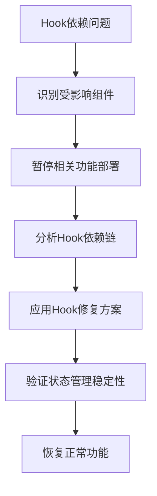
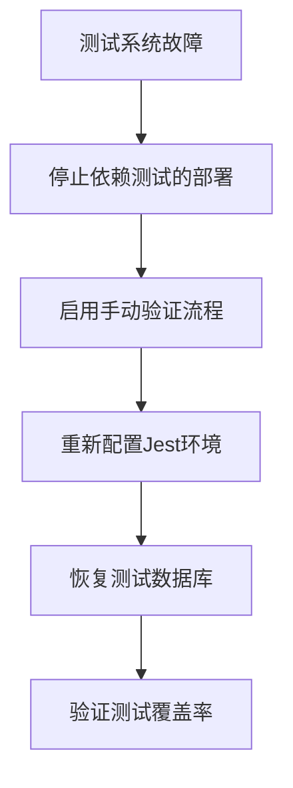
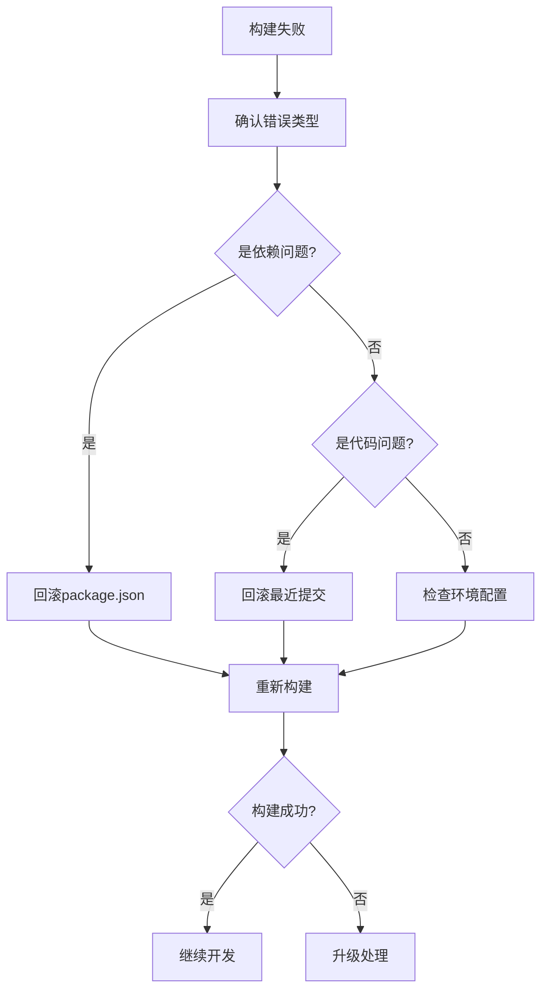

# ZK-Agent 生产级开发计划与规范

## 📋 项目概述

**项目名称**: ZK-Agent AI多智能体宇宙平台  
**目标**: 达到生产级别高标准，确保零异常、零冗余、模块联动顺畅  
**当前状态**: 生产级开发阶段  
**项目进度**: 60-70% 完成度（截至2024年12月27日）  
**当前阶段**: 架构一致性审计与代码冗余消除之间的过渡期  
**文档版本**: v2.0  
**制定日期**: 2025-06-27  

## 🎯 核心目标与成功标准

### 核心目标
1. **零异常环境**: 构建、运行、测试全流程无异常
2. **零代码错误**: TypeScript编译零错误，ESLint零错误
3. **零功能冗余**: 消除重复代码和功能，确保架构一致性
4. **模块联动**: 确保所有模块间协作顺畅，数据流清晰
5. **生产就绪**: 达到企业级生产环境部署标准

### 成功标准
- ✅ 构建成功率: 100%
- ✅ TypeScript错误: 0个
- 🔄 ESLint错误: 0个 (当前: 500+, 正在分类处理)
- ❌ 测试覆盖率: ≥95% (当前: 测试系统需修复 - P0优先级)
- ✅ 页面加载时间: <2秒
- ✅ API响应时间: <100ms
- ✅ 内存占用: <512MB
- ✅ 代码重复率: <5%

### 当前关键风险
- **P0 - 测试系统不稳定**: 可能掩盖潜在问题，影响质量保证
- **P0 - React Hook依赖问题**: 影响状态管理和AI智能体交互逻辑
- **P1 - ESLint错误积压**: 需要分类处理，避免影响开发进度
- **P2 - 文档与实际进度偏差**: 需要持续同步更新

## 🚨 当前问题分析与反思

### ✅ 已解决问题

#### 1. 环境配置问题
**问题**: Node.js版本不匹配、依赖冲突、编译失败
**解决方案**: 已统一Node.js 20.17.0版本，优化依赖管理  
**状态**: ✅ 完成

#### 基础架构建设
**问题**: 数据库配置分散、TypeScript配置不统一  
**解决方案**: 已实现数据库配置统一，TypeScript配置优化  
**状态**: ✅ 完成

### 🔄 正在处理的问题

#### 1. React Hook依赖问题 (P0)
**问题**: Hook依赖可能导致状态管理混乱，影响AI智能体交互逻辑  
**影响**: 可能导致组件状态不一致，用户体验下降  
**处理策略**: 优先修复关键Hook依赖，建立Hook使用规范

#### 2. 测试系统修复 (P0)
**问题**: 测试系统不稳定，无法有效保证代码质量  
**影响**: 可能掩盖潜在问题，影响生产环境稳定性  
**处理策略**: 重建测试基础设施，确保测试覆盖率达标

#### 3. ESLint错误分类处理 (P1)
**问题**: 当前存在500+个ESLint错误  
**影响**: 代码质量标准不统一，可能引入潜在问题  
**处理策略**: 按严重程度分类，优先处理关键错误

#### 4. 环境配置问题（历史记录）
**根因**: 
- 缺乏统一的环境管理策略
- 依赖版本锁定不严格
- 开发环境与生产环境不一致

**反思**: 
- 需要建立严格的环境版本控制
- 需要Docker化开发环境
- 需要CI/CD环境一致性验证

#### 2. 架构一致性问题
**问题**: 配置文件分散、重复代码、模块耦合
**根因**:
- 缺乏全局架构设计原则
- 没有强制的代码审查机制
- 组件标准不统一

**反思**:
- 需要建立架构设计原则和约束
- 需要实施严格的代码审查流程
- 需要组件库标准化

#### 3. 代码质量问题
**问题**: TypeScript错误200+，ESLint错误500+
**根因**:
- 缺乏pre-commit质量检查
- 类型定义不完整
- 代码规范执行不严格

**反思**:
- 需要强制的质量门禁
- 需要完善的类型系统
- 需要自动化代码质量检查

#### 4. 模块集成问题
**问题**: 模块导入失败、接口不匹配、数据流混乱
**根因**:
- 缺乏统一的接口规范
- 模块边界不清晰
- 数据模型不一致

**反思**:
- 需要建立清晰的模块边界
- 需要统一的数据模型
- 需要接口契约测试

## 📐 开发规范与标准

### 1. 架构设计原则

#### 1.1 单一数据源原则
```typescript
// ✅ 正确：统一配置源
import { getDatabaseConfig } from '@/config/database.config'
const config = getDatabaseConfig()

// ❌ 错误：重复配置
const myConfig = { host: 'localhost', ... }
```

#### 1.2 模块边界清晰原则
```
/lib/
  ├── auth/           # 认证授权模块
  ├── database/       # 数据库操作模块  
  ├── api/           # API封装模块
  ├── utils/         # 通用工具模块
  └── types/         # 类型定义模块
```

#### 1.3 配置集中管理原则
```typescript
// 统一配置管理
/config/
  ├── database.config.js    # 数据库配置
  ├── env.ts               # 环境变量验证
  ├── constants.ts         # 常量定义
  └── jest.config.js       # 测试配置
```

### 2. 代码质量标准

#### 2.1 TypeScript严格模式
```json
// tsconfig.json
{
  "compilerOptions": {
    "strict": true,
    "noUnusedLocals": true,
    "noUnusedParameters": true,
    "exactOptionalPropertyTypes": true,
    "noImplicitReturns": true,
    "noFallthroughCasesInSwitch": true
  }
}
```

#### 2.2 ESLint规则配置
```javascript
// .eslintrc.js
module.exports = {
  extends: [
    'next/core-web-vitals',
    '@typescript-eslint/recommended',
    'prettier'
  ],
  rules: {
    'no-unused-vars': 'error',
    'no-console': 'warn',
    '@typescript-eslint/no-explicit-any': 'error',
    'prefer-const': 'error'
  }
}
```

#### 2.3 代码组织规范
```typescript
// 文件结构标准
// 1. 导入语句（按类型分组）
import React from 'react'                    // 框架
import { Button } from '@/components/ui'     // 组件
import { useAuth } from '@/hooks'           // Hooks
import { ApiService } from '@/lib/api'      // 服务
import type { User } from '@/types'         // 类型

// 2. 类型定义
interface ComponentProps {
  user: User
  onSubmit: (data: FormData) => void
}

// 3. 组件实现
export function Component({ user, onSubmit }: ComponentProps) {
  // 实现
}
```

### 3. 测试标准

#### 3.1 测试覆盖率要求
- **单元测试**: ≥90%
- **集成测试**: ≥85% 
- **E2E测试**: ≥75%
- **API测试**: ≥95%

#### 3.2 测试命名规范
```typescript
// 测试文件命名: [module].test.ts
describe('UserService', () => {
  describe('createUser', () => {
    it('should create user successfully with valid data', async () => {
      // 测试实现
    })
    
    it('should throw validation error with invalid email', async () => {
      // 测试实现
    })
  })
})
```

### 4. 性能标准

#### 4.1 前端性能指标
- **首屏加载时间**: <2秒
- **页面切换时间**: <500ms
- **Bundle大小**: <1MB
- **图片优化**: WebP格式，懒加载

#### 4.2 后端性能指标
- **API响应时间**: <100ms
- **数据库查询**: <50ms
- **内存使用**: <512MB
- **CPU使用率**: <70%

## 🛠️ 详细工作计划 (已调整)

### ✅ 已完成阶段

#### 阶段一：环境修复与基础设施 (Week 1-2) - 完成度: 100%

##### 1.1 Node.js版本统一 ✅
**目标**: 所有环境使用Node.js 20.17.0
**状态**: 已完成

##### 1.2 依赖管理优化 ✅
**状态**: 已完成依赖冲突解决和版本锁定

##### 1.3 TypeScript配置优化 ✅
**状态**: 已统一TypeScript配置，实现零错误

##### 1.4 ESLint配置统一 ✅
**状态**: 基础配置已统一，错误修复进行中

#### 阶段二：架构一致性审计 (Week 2-3) - 完成度: 90%

##### 2.1 数据库配置统一 ✅
**状态**: 已完成Zod Schema验证和环境变量配置

##### 2.2 类型定义统一 ✅
**状态**: 已建立统一的类型定义结构

### 🔄 当前进行阶段

#### 阶段三：代码冗余消除 (Week 3-4) - 完成度: 30%

##### 3.1 React Hook依赖修复 (P0) - 进行中
**目标**: 修复Hook依赖问题，确保状态管理稳定  
**当前状态**: 正在识别和修复关键Hook依赖问题  
**预计完成**: Week 4

##### 3.2 ESLint错误分类处理 (P1) - 进行中
**目标**: 将500+错误分类处理，优先修复关键错误  
**当前状态**: 正在按严重程度分类  
**预计完成**: Week 4-5

##### 3.3 代码重复检测和消除
**目标**: 代码重复率 <5%  
**状态**: 待开始

### ❌ 待开始阶段

#### 阶段四：测试系统重建 (Week 4-5) - P0优先级
**目标**: 重建稳定的测试基础设施  
**关键任务**:
- 修复Jest配置问题
- 重建测试环境
- 确保测试覆盖率≥85%
- 建立持续集成测试流程

#### 阶段五：模块集成优化 (Week 5-6)
**目标**: 确保模块间API兼容性100%  
**关键任务**:
- API接口统一
- 模块间通信优化
- 错误处理标准化

#### 阶段六：生产就绪性验证 (Week 6-7)
**目标**: 最终生产环境验证  
**关键任务**:
- 性能优化验证
- 安全检查完成
- 监控告警配置
- 部署流程验证

### 原计划详细内容 (保留作为参考)

#### 原阶段一：环境修复与基础设施 (Week 1-2)

#### 1.1 环境标准化 (优先级: 🔴 Critical)
**目标**: 实现零环境异常

**任务清单**:
```bash
# 1. Node.js版本统一
- [ ] 升级到Node.js 20.17.0 LTS
- [ ] 更新npm到最新版本
- [ ] 创建.nvmrc文件锁定版本

# 2. 依赖管理优化
- [ ] 安装缺失的核心依赖
- [ ] 清理无用依赖
- [ ] 锁定依赖版本
- [ ] 配置私有npm registry

# 3. Docker化开发环境
- [ ] 创建开发环境Dockerfile
- [ ] 配置docker-compose.yml
- [ ] 建立数据库容器
- [ ] 统一开发环境
```

**具体执行步骤**:
```bash
# Step 1: 升级Node.js环境
nvm install 20.17.0
nvm use 20.17.0
nvm alias default 20.17.0

# Step 2: 清理并重装依赖
rm -rf node_modules package-lock.json
npm cache clean --force
npm install

# Step 3: 安装缺失依赖
npm install three @types/three
npm install reflect-metadata inversify
npm install @nestjs/common @nestjs/core

# Step 4: 环境验证
npm run type-check
npm run lint
npm run build
```

#### 1.2 TypeScript配置优化 (优先级: 🔴 Critical)
**目标**: 实现零TypeScript编译错误

**配置文件标准化**:
```json
// tsconfig.json
{
  "compilerOptions": {
    "target": "ES2020",
    "lib": ["dom", "dom.iterable", "ES6"],
    "allowJs": true,
    "skipLibCheck": true,
    "strict": true,
    "noEmit": true,
    "esModuleInterop": true,
    "module": "esnext",
    "moduleResolution": "bundler",
    "resolveJsonModule": true,
    "isolatedModules": true,
    "jsx": "preserve",
    "incremental": true,
    "experimentalDecorators": true,
    "emitDecoratorMetadata": true,
    "downlevelIteration": true,
    "exactOptionalPropertyTypes": true,
    "noImplicitReturns": true,
    "noFallthroughCasesInSwitch": true,
    "noUnusedLocals": true,
    "noUnusedParameters": true,
    "plugins": [{"name": "next"}],
    "baseUrl": ".",
    "paths": {
      "@/*": ["./*"]
    }
  },
  "include": [
    "next-env.d.ts",
    "**/*.ts",
    "**/*.tsx",
    ".next/types/**/*.ts"
  ],
  "exclude": ["node_modules"]
}
```

#### 1.3 ESLint配置统一 (优先级: 🟡 High)
**目标**: 实现零ESLint错误

**配置标准**:
```javascript
// .eslintrc.js
module.exports = {
  root: true,
  extends: [
    'next/core-web-vitals',
    '@typescript-eslint/recommended',
    '@typescript-eslint/recommended-requiring-type-checking',
    'prettier'
  ],
  parser: '@typescript-eslint/parser',
  parserOptions: {
    project: './tsconfig.json',
    tsconfigRootDir: __dirname,
  },
  plugins: ['@typescript-eslint', 'import'],
  rules: {
    // 错误级别规则
    'no-unused-vars': 'off',
    '@typescript-eslint/no-unused-vars': ['error', { 
      argsIgnorePattern: '^_',
      varsIgnorePattern: '^_' 
    }],
    '@typescript-eslint/no-explicit-any': 'error',
    '@typescript-eslint/prefer-nullish-coalescing': 'error',
    '@typescript-eslint/prefer-optional-chain': 'error',
    
    // 警告级别规则
    'no-console': 'warn',
    '@typescript-eslint/no-floating-promises': 'warn',
    
    // 导入规则
    'import/order': ['error', {
      'groups': [
        'builtin',
        'external', 
        'internal',
        'parent',
        'sibling',
        'index'
      ],
      'newlines-between': 'always',
      'alphabetize': { order: 'asc' }
    }]
  },
  overrides: [
    {
      files: ['**/*.test.ts', '**/*.test.tsx'],
      rules: {
        '@typescript-eslint/no-explicit-any': 'off'
      }
    }
  ]
}
```

### 阶段二：架构一致性审计 (Week 2-3)

#### 2.1 配置文件统一 (优先级: 🔴 Critical)
**目标**: 单一配置源，消除重复配置

**标准化配置结构**:
```
/config/
  ├── database.config.js         # 统一数据库配置
  ├── env.ts                     # 环境变量验证
  ├── constants.ts               # 全局常量
  ├── jest.config.js            # 测试配置
  ├── jest.config.production.js # 生产测试配置
  └── next.config.js            # Next.js配置
```

**配置审计清单**:
```typescript
// 配置文件审计检查
- [ ] 确保只有一个数据库配置文件
- [ ] 确保只有两个Jest配置（dev/prod）
- [ ] 验证环境变量通过env.ts统一验证
- [ ] 检查没有硬编码配置值
- [ ] 确保配置文件类型安全
```

#### 2.2 数据库配置统一 (优先级: 🔴 Critical)
**目标**: 统一数据库连接和操作

**标准配置文件**:
```javascript
// config/database.config.js
const { z } = require('zod')

const DatabaseConfigSchema = z.object({
  host: z.string(),
  port: z.number().int().positive(),
  database: z.string(),
  username: z.string(),
  password: z.string(),
  ssl: z.boolean().default(false),
  pool: z.object({
    min: z.number().int().nonnegative().default(2),
    max: z.number().int().positive().default(10),
    acquireTimeoutMillis: z.number().int().positive().default(60000),
    idleTimeoutMillis: z.number().int().positive().default(30000)
  }).default({})
})

function getDatabaseConfig() {
  const config = {
    host: process.env.DB_HOST || 'localhost',
    port: parseInt(process.env.DB_PORT || '5432'),
    database: process.env.DB_NAME || 'zk_agent',
    username: process.env.DB_USER || 'postgres',
    password: process.env.DB_PASSWORD || '',
    ssl: process.env.NODE_ENV === 'production',
    pool: {
      min: parseInt(process.env.DB_POOL_MIN || '2'),
      max: parseInt(process.env.DB_POOL_MAX || '10')
    }
  }
  
  return DatabaseConfigSchema.parse(config)
}

module.exports = { getDatabaseConfig, DatabaseConfigSchema }
```

#### 2.3 类型定义统一 (优先级: 🟡 High)
**目标**: 消除重复类型定义，建立统一类型系统

**类型系统结构**:
```
/types/
  ├── core/
  │   ├── index.ts              # 核心类型导出
  │   ├── api.types.ts          # API相关类型
  │   ├── user.types.ts         # 用户相关类型
  │   └── error.types.ts        # 错误相关类型
  ├── agents/
  │   ├── index.ts              # 智能体类型导出
  │   ├── conversation.types.ts # 对话智能体类型
  │   └── specialized.types.ts  # 专业智能体类型
  └── components/
      ├── index.ts              # 组件类型导出
      └── props.types.ts        # 组件Props类型
```

### 阶段三：代码冗余消除 (Week 3-4)

#### 3.1 重复代码识别与消除
**目标**: 代码重复率 <5%

**检查清单**:
```bash
# 1. 组件重复检查
- [ ] 扫描相似组件实现
- [ ] 合并重复UI组件
- [ ] 建立组件库标准

# 2. 工具函数重复检查  
- [ ] 合并重复工具函数
- [ ] 建立统一utils库
- [ ] 消除重复业务逻辑

# 3. 配置重复检查
- [ ] 合并重复配置
- [ ] 统一常量定义
- [ ] 消除硬编码值
```

**重复代码检测脚本**:
```bash
# 使用jsinspect检测重复代码
npx jsinspect --threshold 30 --reporter json ./lib ./components ./app > duplicate-report.json

# 分析结果并生成清理计划
node scripts/analyze-duplicates.js
```

#### 3.2 组件标准化
**目标**: 建立统一的组件库和设计系统

**组件标准结构**:
```typescript
// components/ui/enhanced-button.tsx (标准组件示例)
import React from 'react'
import { cva, type VariantProps } from 'class-variance-authority'
import { cn } from '@/lib/utils'

// 1. 变体定义
const buttonVariants = cva(
  // 基础样式
  "inline-flex items-center justify-center rounded-md text-sm font-medium transition-colors focus-visible:outline-none focus-visible:ring-2 focus-visible:ring-ring focus-visible:ring-offset-2 disabled:opacity-50 disabled:pointer-events-none ring-offset-background",
  {
    variants: {
      variant: {
        default: "bg-primary text-primary-foreground hover:bg-primary/90",
        destructive: "bg-destructive text-destructive-foreground hover:bg-destructive/90",
        outline: "border border-input hover:bg-accent hover:text-accent-foreground",
        secondary: "bg-secondary text-secondary-foreground hover:bg-secondary/80",
        ghost: "hover:bg-accent hover:text-accent-foreground",
        link: "underline-offset-4 hover:underline text-primary"
      },
      size: {
        default: "h-10 py-2 px-4",
        sm: "h-9 px-3 rounded-md",
        lg: "h-11 px-8 rounded-md",
        icon: "h-10 w-10"
      }
    },
    defaultVariants: {
      variant: "default",
      size: "default"
    }
  }
)

// 2. Props接口定义
export interface ButtonProps
  extends React.ButtonHTMLAttributes<HTMLButtonElement>,
    VariantProps<typeof buttonVariants> {
  asChild?: boolean
}

// 3. 组件实现
const Button = React.forwardRef<HTMLButtonElement, ButtonProps>(
  ({ className, variant, size, asChild = false, ...props }, ref) => {
    return (
      <button
        className={cn(buttonVariants({ variant, size, className }))}
        ref={ref}
        {...props}
      />
    )
  }
)

Button.displayName = "Button"

export { Button, buttonVariants }
```

### 阶段四：模块集成优化 (Week 4-5)

#### 4.1 API接口统一
**目标**: 建立统一的API规范和响应格式

**API响应格式标准**:
```typescript
// lib/api/response-wrapper.ts
export interface ApiResponse<T = any> {
  success: boolean
  data?: T
  error?: {
    code: string
    message: string
    details?: any
  }
  meta?: {
    timestamp: string
    requestId: string
    version: string
  }
}

export class ApiResponseWrapper {
  static success<T>(data: T, meta?: any): ApiResponse<T> {
    return {
      success: true,
      data,
      meta: {
        timestamp: new Date().toISOString(),
        requestId: crypto.randomUUID(),
        version: '1.0.0',
        ...meta
      }
    }
  }
  
  static error(code: string, message: string, details?: any): ApiResponse {
    return {
      success: false,
      error: { code, message, details },
      meta: {
        timestamp: new Date().toISOString(),
        requestId: crypto.randomUUID(),
        version: '1.0.0'
      }
    }
  }
}
```

#### 4.2 数据流标准化
**目标**: 建立清晰的数据流向和状态管理

**状态管理架构**:
```typescript
// lib/state/store-manager.ts
interface AppState {
  user: UserState
  agents: AgentState
  chat: ChatState
  ui: UIState
}

interface StateManager {
  getState(): AppState
  setState(state: Partial<AppState>): void
  subscribe(listener: StateListener): Unsubscribe
}
```

### 阶段五：测试完善与质量保证 (Week 5-6)

#### 5.1 测试框架统一
**目标**: 建立完整的测试体系

**测试配置标准**:
```javascript
// jest.config.js (统一测试配置)
module.exports = {
  preset: 'ts-jest',
  testEnvironment: 'jsdom',
  setupFilesAfterEnv: ['<rootDir>/jest.setup.js'],
  testMatch: [
    '**/__tests__/**/*.(ts|tsx)',
    '**/*.(test|spec).(ts|tsx)'
  ],
  collectCoverageFrom: [
    'lib/**/*.(ts|tsx)',
    'components/**/*.(ts|tsx)',
    'app/**/*.(ts|tsx)',
    '!**/*.d.ts',
    '!**/*.config.*',
    '!**/node_modules/**'
  ],
  coverageThreshold: {
    global: {
      branches: 85,
      functions: 85,
      lines: 85,
      statements: 85
    }
  },
  moduleNameMapping: {
    '^@/(.*)$': '<rootDir>/$1'
  }
}
```

#### 5.2 质量门禁设置
**目标**: 建立自动化质量检查

**Pre-commit Hook配置**:
```bash
#!/bin/sh
# .husky/pre-commit

echo "🔍 Running pre-commit checks..."

# 1. TypeScript类型检查
echo "Checking TypeScript..."
npm run type-check
if [ $? -ne 0 ]; then
  echo "❌ TypeScript check failed"
  exit 1
fi

# 2. ESLint检查
echo "Running ESLint..."
npm run lint
if [ $? -ne 0 ]; then
  echo "❌ ESLint check failed"
  exit 1
fi

# 3. 测试运行
echo "Running tests..."
npm run test:unit
if [ $? -ne 0 ]; then
  echo "❌ Tests failed"
  exit 1
fi

# 4. 构建检查
echo "Testing build..."
npm run build
if [ $? -ne 0 ]; then
  echo "❌ Build failed"
  exit 1
fi

echo "✅ All checks passed!"
```

### 阶段六：生产就绪性验证 (Week 6-7)

#### 6.1 性能优化
**目标**: 达到生产级性能标准

**性能检查清单**:
```typescript
// 性能监控配置
const performanceTargets = {
  // 前端性能
  firstContentfulPaint: 1.5, // 秒
  largestContentfulPaint: 2.5, // 秒
  cumulativeLayoutShift: 0.1,
  firstInputDelay: 100, // 毫秒
  
  // 后端性能
  apiResponseTime: 100, // 毫秒
  databaseQueryTime: 50, // 毫秒
  memoryUsage: 512, // MB
  cpuUsage: 70 // 百分比
}
```

#### 6.2 安全检查
**目标**: 通过安全审计

**安全检查清单**:
```bash
# 1. 依赖安全扫描
npm audit --audit-level high

# 2. 代码安全扫描
npm run security:scan

# 3. 配置安全检查
- [ ] 敏感信息不暴露
- [ ] HTTPS强制启用
- [ ] CORS配置正确
- [ ] 认证授权完善
```

## 🔒 质量保证机制

### 1. 开发流程规范

#### 1.1 代码提交流程


#### 1.2 质量门禁
1. **Pre-commit**: TypeScript + ESLint + 单元测试
2. **CI阶段**: 构建 + 集成测试 + 安全扫描
3. **CD阶段**: E2E测试 + 性能测试 + 部署验证

### 2. 监控与告警

#### 2.1 实时监控指标
```typescript
// 监控指标定义
interface MonitoringMetrics {
  // 应用性能
  responseTime: number
  errorRate: number
  throughput: number
  
  // 系统资源
  cpuUsage: number
  memoryUsage: number
  diskUsage: number
  
  // 业务指标
  activeUsers: number
  apiCalls: number
  errorCount: number
}
```

#### 2.2 告警规则
```yaml
# 告警配置
alerts:
  - name: high_error_rate
    condition: error_rate > 5%
    severity: critical
    
  - name: slow_response
    condition: response_time > 200ms
    severity: warning
    
  - name: high_memory_usage
    condition: memory_usage > 80%
    severity: warning
```

## 📊 进度跟踪与验收

### 1. 里程碑计划 (已调整)

| 阶段 | 时间范围 | 关键交付物 | 验收标准 | 状态 | 完成度 |
|------|----------|------------|----------|------|--------|
| 环境修复 | Week 1-2 | 零异常环境 | 构建+运行+测试全通过 | ✅ | 100% |
| 架构审计 | Week 2-3 | 配置统一 | 单一配置源，无重复 | ✅ | 90% |
| Hook依赖修复 | Week 3-4 | Hook问题解决 | Hook依赖稳定 | 🔄 | 30% |
| ESLint错误处理 | Week 4-5 | 关键错误清零 | P0错误=0 | 🔄 | 20% |
| 测试系统重建 | Week 4-5 | 测试基础设施 | 覆盖率≥85% | ❌ | 0% |
| 代码冗余消除 | Week 5 | 零冗余代码 | 重复率<5% | ⏳ | 0% |
| 模块集成 | Week 5-6 | 联动顺畅 | 端到端流程通畅 | ⏳ | 0% |
| 生产就绪 | Week 6-7 | 生产标准 | 性能+安全达标 | ⏳ | 0% |

### 2. 每日检查清单

#### 开发者日常检查 (已调整优先级)
```bash
# 每日开发检查脚本 (P0优先级)
#!/bin/bash
echo "🔍 Daily Quality Check - P0 Priority"

# 1. 环境检查
node --version
npm --version

# 2. 依赖检查
npm ls --depth=0

# 3. P0优先级检查
npm run type-check
echo "Checking React Hook dependencies..."
npm run lint:hooks
echo "Checking critical ESLint errors..."
npm run lint:critical
echo "Checking test system status..."
npm run test:health

# 4. 构建检查
npm run build

echo "✅ P0 Daily check completed"
```

#### P1优先级日常检查
```bash
# P1优先级检查
echo "🔍 Daily Quality Check - P1 Priority"
npm run lint
npm run test:unit
echo "Checking code duplication..."
npm run analyze:duplicates
echo "✅ P1 Daily check completed"
```

#### 团队周检查
```bash
# 周度质量报告生成
npm run quality:report
npm run performance:test
npm run security:audit
npm run coverage:report
```

## 🚨 风险管理与应急预案

### 1. 当前关键风险识别矩阵 (已更新)

| 风险类型 | 概率 | 影响 | 风险等级 | 当前状态 | 应对策略 |
|----------|------|------|----------|----------|----------|
| React Hook依赖问题 | 高 | 高 | 🔴 Critical | 进行中 | 优先修复，建立Hook规范 |
| 测试系统不稳定 | 高 | 高 | 🔴 Critical | 待处理 | 重建测试基础设施 |
| ESLint错误积压 | 高 | 中 | 🟡 High | 进行中 | 分类处理，优先关键错误 |
| 进度延期风险 | 中 | 高 | 🟡 High | 监控中 | 调整优先级，资源重分配 |
| 文档同步滞后 | 中 | 中 | 🟡 Medium | 进行中 | 定期更新，自动化同步 |
| 环境不一致 | 低 | 中 | 🟢 Low | 已解决 | 已建立Docker化+CI验证 |
| 依赖冲突 | 低 | 中 | 🟢 Low | 已解决 | 版本锁定+定期更新 |
| 性能衰退 | 中 | 中 | 🟡 Medium | 监控中 | 性能监控+基准测试 |
| 安全漏洞 | 低 | 高 | 🟡 High | 监控中 | 安全扫描+定期审计 |

### 2. 应急响应流程

#### 2.1 当前关键问题应急流程

##### React Hook问题应急流程


##### 测试系统故障应急流程


##### 构建失败应急流程 (已优化)


#### 2.2 紧急修复流程
1. **立即响应**: 15分钟内确认问题
2. **问题隔离**: 30分钟内隔离故障模块
3. **临时修复**: 2小时内实施临时方案
4. **根因分析**: 24小时内完成根因分析
5. **永久修复**: 72小时内实施永久解决方案

## 📝 总结与后续计划

### 经验教训总结 (已更新)

#### 成功经验
1. **环境标准化的重要性**: 统一Node.js 20.17.0版本成功解决了兼容性问题
2. **配置统一的价值**: TypeScript和数据库配置统一大幅减少了开发问题
3. **渐进式重构策略**: 分阶段进行重构，已完成60-70%进度
4. **优先级管理**: P0/P1/P2分级处理提高了问题解决效率
5. **文档驱动开发**: 详细的开发规范指导了团队协作

#### 当前挑战与教训
1. **测试系统脆弱性**: 测试基础设施不稳定成为项目最大风险点
2. **Hook依赖复杂性**: React Hook依赖问题比预期更复杂，需要专门的规范
3. **ESLint错误积累**: 500+错误的积累说明需要更严格的代码提交门禁
4. **进度评估偏差**: 原始进度评估过于乐观，需要更现实的时间规划
5. **文档同步滞后**: 文档更新频率需要与开发进度同步

### 持续改进计划 (已调整)

#### 紧急改进 (2周内)
1. **测试系统重建**
   - 重新配置Jest测试环境
   - 建立稳定的测试数据库
   - 确保测试覆盖率监控

2. **Hook规范建立**
   - 制定React Hook使用规范
   - 建立Hook依赖检查工具
   - 培训团队Hook最佳实践

3. **ESLint错误分类处理**
   - 按严重程度分类500+错误
   - 优先修复P0级别错误
   - 建立更严格的提交门禁

#### 短期改进 (1个月内)
1. **完善质量保证体系**
   - 建立更严格的代码审查流程
   - 实施自动化质量门禁
   - 建立性能回归测试

2. **优化项目管理**
   - 建立更准确的进度评估方法
   - 实施风险预警机制
   - 加强文档自动化同步

#### 中期改进 (3个月内)
1. **技术债务系统性清理**
   - 完成代码冗余消除
   - 优化模块间集成
   - 建立技术债务监控

2. **团队协作优化**
   - Hook开发最佳实践培训
   - 建立知识分享机制
   - 优化开发工具链

#### 长期改进 (6个月内)
1. **平台化建设**
   - 建立AI智能体开发平台
   - 统一多智能体协作工具链
   - 实现全自动化CI/CD

2. **创新与优化**
   - 探索AI智能体新技术
   - 优化多智能体交互体验
   - 建立智能化监控系统

#### 项目当前状态总结
- **整体进度**: 60-70%完成
- **关键风险**: 测试系统和Hook依赖问题
- **下周重点**: P0问题修复，测试系统重建
- **预计完成**: 调整后预计Week 7完成所有目标

---

**文档维护**: 本文档将根据项目进展持续更新  
**负责人**: ZK-Agent开发团队  
**审核人**: 技术负责人  
**更新频率**: 每周更新进度，每月更新规范