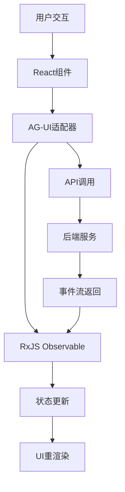
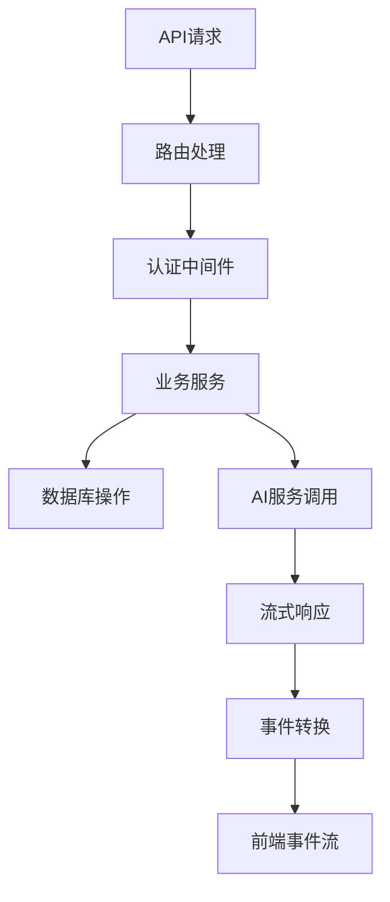

# ZK-Agent 前后端分离架构深度分析

## 概述

本文档深入分析 ZK-Agent 项目中两个核心文件的架构设计，特别是它们在前后端分离架构中的作用：
- `lib/ag-ui/core-adapter.ts` - AG-UI核心适配器
- `lib/multi-agent/deep-research.ts` - 深度研究服务

## 1. 架构设计模式分析

### 1.1 AG-UI核心适配器 (core-adapter.ts)

#### 设计模式
- **适配器模式 (Adapter Pattern)**: 将 FastGPT API 转换为 AG-UI 事件流
- **观察者模式 (Observer Pattern)**: 使用 RxJS Observable 处理事件流
- **状态管理模式**: 维护会话状态和全局变量

#### 核心功能
```typescript
/**
 * AG-UI核心适配器 - 将FastGPT的所有功能转换为AG-UI事件流
 */
export class AgUICoreAdapter {
  private eventSubject = new Subject<BaseEvent>();
  private messageIdCounter = 0;
  private toolCallIdCounter = 0;
  private state: Record<string, any> = {};
}
```

#### 架构职责
1. **协议转换**: FastGPT API → AG-UI 事件协议
2. **状态管理**: 维护会话状态、全局变量、消息历史
3. **事件流处理**: 实时流式数据转换和分发
4. **错误处理**: 统一的错误处理和恢复机制

#### 前后端分离中的作用
- **前端抽象层**: 为前端提供统一的事件接口
- **协议适配**: 屏蔽后端 API 差异
- **状态同步**: 确保前后端状态一致性

### 1.2 深度研究服务 (deep-research.ts)

#### 设计模式
- **策略模式 (Strategy Pattern)**: 多种搜索策略和信息源选择
- **工厂模式 (Factory Pattern)**: 动态创建研究组件
- **管道模式 (Pipeline Pattern)**: 研究流程的阶段化处理
- **缓存模式 (Cache Pattern)**: 研究结果缓存优化

#### 核心架构
```typescript
/**
 * 深度研究服务 - 集成Google DeepResearch功能
 */
export class DeepResearchService {
  private queryProcessor: QueryProcessor;
  private informationRetrieval: InformationRetrieval;
  private synthesisEngine: SynthesisEngine;
  private reportGenerator: ReportGenerator;
  private researchCache: Map<string, CachedResearch> = new Map();
}
```

#### 处理流程
1. **查询处理**: 问题分解和意图识别
2. **研究规划**: 制定搜索策略和信息源选择
3. **信息检索**: 多源信息获取和质量过滤
4. **综合分析**: 信息聚合和模式识别
5. **报告生成**: 结构化研究报告输出

#### 前后端分离中的作用
- **业务逻辑层**: 核心研究算法和流程
- **数据处理**: 复杂的信息检索和分析
- **服务封装**: 为前端提供高级研究能力

## 2. 前后端分离架构实现

### 2.1 技术栈选择

#### 前端技术栈
- **框架**: Next.js 14+ (React 18+)
- **状态管理**: RxJS Observable + React Context
- **UI组件**: Radix UI + Tailwind CSS
- **类型系统**: TypeScript 5.0+
- **构建工具**: Next.js 内置构建系统

#### 后端技术栈
- **运行时**: Node.js 18+ (Edge Runtime)
- **API框架**: Next.js API Routes
- **数据库**: Prisma ORM + PostgreSQL
- **缓存**: Redis
- **认证**: NextAuth.js
- **AI集成**: OpenAI API + FastGPT

### 2.2 API设计模式

#### RESTful API 结构
```
/api/
├── multi-agent/          # 多智能体系统
│   ├── agents/[id]/      # 智能体管理
│   ├── teams/[id]/       # 团队管理
│   ├── executions/[id]/  # 执行管理
│   └── deep-research/    # 深度研究
├── ag-ui/                # AG-UI接口
│   ├── chat/             # 对话接口
│   ├── cad-analysis/     # CAD分析
│   └── compliance/       # 合规检查
└── auth/                 # 认证系统
    ├── login/
    ├── register/
    └── [...nextauth]/
```

#### 事件驱动架构
```typescript
// AG-UI事件类型
export enum EventType {
  // 运行生命周期
  RUN_STARTED = 'RUN_STARTED',
  RUN_FINISHED = 'RUN_FINISHED',
  
  // 消息事件
  TEXT_MESSAGE_START = 'TEXT_MESSAGE_START',
  TEXT_MESSAGE_CONTENT = 'TEXT_MESSAGE_CONTENT',
  TEXT_MESSAGE_END = 'TEXT_MESSAGE_END',
  
  // 工具调用
  TOOL_CALL_START = 'TOOL_CALL_START',
  TOOL_CALL_ARGS = 'TOOL_CALL_ARGS',
  TOOL_CALL_END = 'TOOL_CALL_END',
  
  // 状态管理
  STATE_SNAPSHOT = 'STATE_SNAPSHOT',
}
```

### 2.3 数据流架构

#### 前端数据流


#### 后端数据流


## 3. 核心设计原则

### 3.1 单一职责原则
- **AG-UI适配器**: 专注于协议转换和事件流管理
- **深度研究服务**: 专注于研究逻辑和数据处理
- **API路由**: 专注于请求处理和响应格式化

### 3.2 依赖倒置原则
```typescript
// 接口定义
interface IResearchService {
  executeResearch(task: ResearchTask): Promise<DeepResearchResult>;
}

// 具体实现
export class DeepResearchService implements IResearchService {
  // 实现细节
}
```

### 3.3 开闭原则
- **插件化架构**: 支持新的AI模型和工具集成
- **策略模式**: 支持不同的搜索和分析策略
- **适配器模式**: 支持新的协议和API集成

## 4. 性能优化策略

### 4.1 前端优化
- **代码分割**: Next.js 动态导入和路由级分割
- **状态优化**: RxJS 操作符优化和内存管理
- **缓存策略**: SWR/React Query 数据缓存
- **懒加载**: 组件和资源按需加载

### 4.2 后端优化
- **连接池**: 数据库连接池管理
- **缓存层**: Redis 多级缓存策略
- **流式处理**: 大数据量的流式传输
- **并发控制**: 智能体执行的并发限制

### 4.3 网络优化
- **HTTP/2**: 多路复用和服务器推送
- **压缩**: Gzip/Brotli 响应压缩
- **CDN**: 静态资源分发网络
- **WebSocket**: 实时通信优化

## 5. 安全架构

### 5.1 认证授权
```typescript
// 基于 NextAuth.js 的认证系统
export const authOptions: NextAuthOptions = {
  providers: [
    // OAuth providers
  ],
  callbacks: {
    jwt: async ({ token, user }) => {
      // JWT token 处理
    },
    session: async ({ session, token }) => {
      // Session 处理
    },
  },
};
```

### 5.2 数据安全
- **输入验证**: Zod schema 验证
- **SQL注入防护**: Prisma ORM 参数化查询
- **XSS防护**: 内容安全策略 (CSP)
- **CSRF防护**: CSRF token 验证

### 5.3 API安全
- **速率限制**: API 调用频率控制
- **权限控制**: 基于角色的访问控制 (RBAC)
- **数据加密**: 敏感数据传输加密
- **审计日志**: 操作日志记录和监控

## 6. 可扩展性设计

### 6.1 水平扩展
- **无状态设计**: API 服务无状态化
- **负载均衡**: 多实例负载分发
- **数据库分片**: 数据水平分割
- **缓存集群**: Redis 集群部署

### 6.2 垂直扩展
- **模块化架构**: 功能模块独立部署
- **微服务化**: 服务拆分和独立扩展
- **容器化**: Docker 容器部署
- **云原生**: Kubernetes 编排管理

## 7. 监控和运维

### 7.1 性能监控
```typescript
// 性能指标收集
export class PerformanceMonitor {
  static recordApiLatency(endpoint: string, duration: number) {
    // 记录API延迟
  }
  
  static recordMemoryUsage(service: string, usage: number) {
    // 记录内存使用
  }
}
```

### 7.2 错误监控
- **错误追踪**: Sentry 错误监控
- **日志聚合**: 结构化日志收集
- **告警系统**: 异常情况实时告警
- **健康检查**: 服务健康状态监控

## 8. 开发工具链

### 8.1 代码质量
- **ESLint**: 代码规范检查
- **Prettier**: 代码格式化
- **TypeScript**: 静态类型检查
- **Husky**: Git hooks 自动化

### 8.2 测试策略
- **单元测试**: Jest + Testing Library
- **集成测试**: API 端到端测试
- **E2E测试**: Playwright 自动化测试
- **性能测试**: K6 负载测试

## 9. 部署架构

### 9.1 容器化部署
```dockerfile
# Dockerfile 示例
FROM node:18-alpine
WORKDIR /app
COPY package*.json ./
RUN npm ci --only=production
COPY . .
RUN npm run build
EXPOSE 3000
CMD ["npm", "start"]
```

### 9.2 CI/CD 流水线
```yaml
# GitHub Actions 示例
name: CI/CD Pipeline
on:
  push:
    branches: [main]
jobs:
  test:
    runs-on: ubuntu-latest
    steps:
      - uses: actions/checkout@v3
      - name: Setup Node.js
        uses: actions/setup-node@v3
      - name: Install dependencies
        run: npm ci
      - name: Run tests
        run: npm test
      - name: Build application
        run: npm run build
```

## 10. 总结与建议

### 10.1 架构优势
1. **清晰的职责分离**: 前后端各司其职，便于维护
2. **高度可扩展**: 模块化设计支持功能扩展
3. **性能优化**: 多层缓存和流式处理
4. **安全可靠**: 完善的安全机制和错误处理

### 10.2 改进建议
1. **微服务化**: 考虑将大型服务拆分为微服务
2. **GraphQL**: 考虑使用 GraphQL 优化数据查询
3. **边缘计算**: 利用 Edge Runtime 提升响应速度
4. **AI优化**: 集成更多AI模型和优化策略

### 10.3 技术演进
1. **React 18+**: 利用并发特性优化用户体验
2. **Next.js 14+**: 使用最新的 App Router 和优化特性
3. **TypeScript 5.0+**: 利用新的类型系统特性
4. **Node.js 18+**: 使用最新的运行时特性

---

**文档版本**: 1.0  
**创建日期**: 2024-12-19  
**最后更新**: 2024-12-19  
**维护者**: ZK-Agent Team