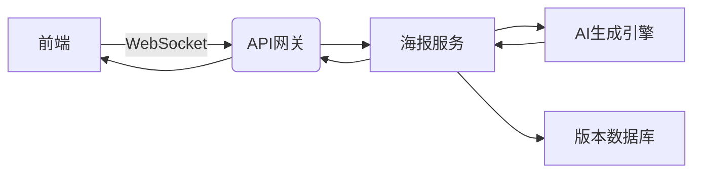

# AI海报设计模块详细设计

---

## 1. 功能逻辑
- **智能生成**：输入文案自动生成10+版式方案
- **深度编辑**：支持图层级修改（文字/图片/矢量元素）
- **多端同步**：Web/移动端实时协作编辑

## 2. 数据结构
```typescript
interface PosterDesign {
  id: string;
  templateId: string;
  layers: {
    type: 'text' | 'image' | 'shape';
    content: string; // 文本内容或图片URL
    style: CSSProperties; // 样式配置
    aiGenerated: boolean;
  }[];
  version: number;
}
```

## 3. 数据流向


## 4. 用户故事
- 作为设计师，我需要3步完成专业海报输出
- 作为团队，我们需要实时看到成员的编辑内容

## 5. 前沿技术
- **AI生成**：Stable Diffusion XL + ControlNet精准控制
- **实时协作**：Yjs CRDT算法 + WebRTC直连
- **渲染优化**：React-Three-Fiber实现GPU加速

## 6. 优化方向
- **性能**：差分同步算法减少数据传输量
- **功能**：3D海报设计能力（基于Three.js）
- **商业化**：模板市场与设计师分成体系

---

> 设计约束：所有AI生成内容需标注水印 