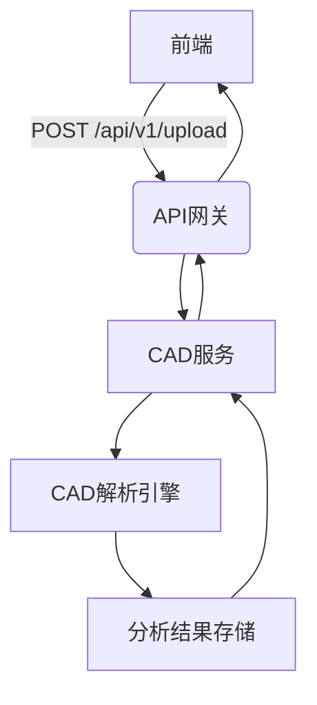

# CAD分析模块详细设计

---

## 1. 功能逻辑
- **文件处理**：支持DWG/DXF格式解析（最大50MB）
- **智能分析**：几何特征提取 + 合规性检查
- **历史追溯**：版本对比与差异可视化

## 2. 数据结构
```typescript
interface CADFile {
  id: string;
  userId: string;
  originalName: string;
  s3Key: string; // 文件存储路径
  analysisResult: {
    components: number;
    violations: string[];
    score: number;
  };
  createdAt: Date;
}
```

## 3. 数据流向


## 4. 用户故事
- 作为工程师，我需要10秒内完成CAD文件解析
- 作为管理员，我需查看全团队分析报告汇总

## 5. 前沿技术
- **解析引擎**：AutoCAD官方API + OpenDesign联盟库
- **可视化**：Three.js + WebGPU加速渲染
- **AI增强**：集成NVIDIA Omniverse进行3D差异检测

## 6. 优化方向
- **性能**：WASM版解析器（预计提升3倍速度）
- **功能**：实时协作标注系统
- **扩展性**：插件式分析规则引擎

---

> 安全要求：所有文件传输需TLS1.3加密 