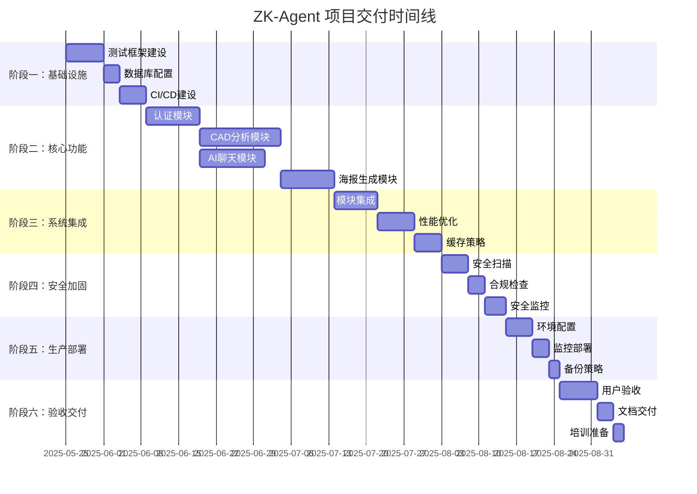

# ZK-Agent 项目生产级交付工作计划

## 项目概述

**项目名称**: ZK-Agent AI多智能体宇宙平台  
**交付目标**: 生产级别高端交付水平  
**排除功能**: 人脸增强功能（暂缓开发）  
**核心原则**: 真实环境运行、无模拟数据、严格规范遵守

---

## 阶段一：基础设施完善与测试框架建设

### 📋 工作内容
1. **测试框架标准化**
2. **数据库环境配置**
3. **CI/CD流程建立**
4. **代码质量保障体系**

### 🎯 验收指标

#### 1.1 测试框架标准化
- **覆盖率指标**: 
  - 单元测试覆盖率 ≥ 90%
  - 集成测试覆盖率 ≥ 80%
  - API测试覆盖率 ≥ 98%
- **测试执行指标**:
  - 测试执行时间 ≤ 5分钟（单元测试）
  - 测试执行时间 ≤ 15分钟（集成测试）
  - 测试成功率 ≥ 99%
- **质量指标**:
  - 0个测试用例失败
  - 0个测试环境配置错误
  - 100%测试文件符合命名规范

#### 1.2 数据库环境配置
- **环境隔离指标**:
  - 生产数据库(zkagent1)与测试数据库(zkagent2)完全隔离
  - 数据库连接成功率 = 100%
  - 数据库响应时间 ≤ 100ms
- **数据完整性指标**:
  - 数据迁移成功率 = 100%
  - 数据一致性检查通过率 = 100%
  - 备份恢复测试成功率 = 100%

#### 1.3 CI/CD流程建立
- **自动化指标**:
  - 代码提交后自动测试触发率 = 100%
  - 自动化部署成功率 ≥ 95%
  - 回滚时间 ≤ 5分钟
- **质量门禁指标**:
  - 代码质量检查通过率 = 100%
  - 安全扫描通过率 = 100%
  - 性能测试通过率 = 100%

### ⚠️ 注意事项
1. **严格遵守目录规范**: 所有文件必须按照既定目录结构放置
2. **禁止模拟数据**: 所有测试必须使用真实数据库连接
3. **版本控制**: 每个配置变更必须有版本记录和回滚方案
4. **权限管理**: WSL环境权限问题需要提前解决

### 📊 测试指标
```yaml
测试执行标准:
  单元测试:
    - 执行频率: 每次代码提交
    - 超时时间: 10秒/测试用例
    - 内存使用: ≤ 512MB
  集成测试:
    - 执行频率: 每日构建
    - 超时时间: 30秒/测试用例
    - 数据库连接: 真实连接
  性能测试:
    - 响应时间: ≤ 100ms (P95)
    - 并发用户: ≥ 100
    - 错误率: ≤ 0.1%
```

---

## 阶段二：核心功能模块开发与测试

### 📋 工作内容
1. **认证授权模块**
2. **CAD分析模块**
3. **AI聊天模块**
4. **海报生成模块**

### 🎯 验收指标

#### 2.1 认证授权模块
- **功能完整性指标**:
  - 用户注册成功率 ≥ 99%
  - 用户登录成功率 ≥ 99.5%
  - JWT令牌验证准确率 = 100%
  - 密码加密强度 ≥ bcrypt 12轮
- **安全性指标**:
  - SQL注入防护测试通过率 = 100%
  - XSS攻击防护测试通过率 = 100%
  - 暴力破解防护测试通过率 = 100%
  - 会话管理安全测试通过率 = 100%
- **性能指标**:
  - 登录响应时间 ≤ 500ms
  - 令牌验证时间 ≤ 50ms
  - 并发登录支持 ≥ 1000用户

#### 2.2 CAD分析模块
- **功能准确性指标**:
  - CAD文件解析成功率 ≥ 95%
  - 分析结果准确率 ≥ 90%
  - 支持文件格式覆盖率 ≥ 80%
- **性能指标**:
  - 文件上传速度 ≥ 10MB/s
  - 分析处理时间 ≤ 30秒/MB
  - 内存使用效率 ≤ 2GB/分析任务
- **稳定性指标**:
  - 大文件处理成功率 ≥ 98%
  - 并发分析任务支持 ≥ 50个
  - 系统崩溃率 ≤ 0.01%

#### 2.3 AI聊天模块
- **智能化指标**:
  - 对话理解准确率 ≥ 85%
  - 与fastgpt对接百分之百通过
  - 响应相关性评分 ≥ 4.0/5.0
  - 多轮对话连贯性 ≥ 80%
- **性能指标**:
  - 响应时间 ≤ 3秒
  - 并发对话支持 ≥ 500个
  - 消息处理吞吐量 ≥ 1000条/秒
- **可用性指标**:
  - 服务可用性 ≥ 99.9%
  - 错误恢复时间 ≤ 30秒
  - 数据持久化成功率 = 100%

#### 2.4 海报生成模块
- **生成质量指标**:
  - 海报生成成功率 ≥ 95%
  - 图像质量评分 ≥ 4.0/5.0
  - 模板适配准确率 ≥ 90%
- **性能指标**:
  - 生成时间 ≤ 10秒/海报
  - 高分辨率支持 ≥ 4K
  - 并发生成支持 ≥ 20个任务
- **格式支持指标**:
  - 输出格式支持率 ≥ 95% (PDF, PNG, JPG)
  - 模板库覆盖率 ≥ 50种样式
  - 自定义元素支持率 ≥ 80%

### ⚠️ 注意事项
1. **数据安全**: 所有用户数据必须加密存储
2. **API设计**: 严格遵循RESTful设计原则
3. **错误处理**: 所有异常情况必须有明确的错误码和处理机制
4. **日志记录**: 关键操作必须有详细的审计日志

### 📊 测试指标
```yaml
模块测试标准:
  认证模块:
    - 安全测试: 100%通过
    - 性能测试: P95 ≤ 500ms
    - 负载测试: 1000并发用户
  CAD模块:
    - 功能测试: 95%成功率
    - 压力测试: 100MB文件处理
    - 兼容性测试: 10种CAD格式
  AI聊天:
    - 智能测试: 85%准确率
    - 性能测试: 3秒响应时间
    - 并发测试: 500个对话
  海报生成:
    - 质量测试: 4.0/5.0评分
    - 速度测试: 10秒/海报
    - 格式测试: 95%支持率
```

---

## 阶段三：系统集成与性能优化

### 📋 工作内容
1. **模块间集成测试**
2. **系统性能优化**
3. **数据库性能调优**
4. **缓存策略实施**

### 🎯 验收指标

#### 3.1 系统集成指标
- **接口兼容性**:
  - API接口兼容性测试通过率 = 100%
  - 数据流转准确性 = 100%
  - 模块间通信延迟 ≤ 100ms
- **数据一致性**:
  - 跨模块数据一致性 = 100%
  - 事务完整性保证 = 100%
  - 数据同步准确率 = 100%

#### 3.2 性能优化指标
- **响应时间优化**:
  - 页面加载时间 ≤ 2秒
  - API响应时间 ≤ 500ms (P95)
  - 数据库查询时间 ≤ 100ms (P90)
- **资源利用率**:
  - CPU使用率 ≤ 70% (正常负载)
  - 内存使用率 ≤ 80% (正常负载)
  - 磁盘I/O效率 ≥ 80%
- **并发处理能力**:
  - 同时在线用户 ≥ 1000
  - 并发请求处理 ≥ 5000 QPS
  - 系统稳定性 ≥ 99.9%

#### 3.3 缓存策略指标
- **缓存命中率**:
  - Redis缓存命中率 ≥ 85%
  - 静态资源缓存命中率 ≥ 95%
  - 数据库查询缓存命中率 ≥ 70%
- **缓存性能**:
  - 缓存读取时间 ≤ 10ms
  - 缓存写入时间 ≤ 20ms
  - 缓存失效策略准确率 = 100%

### ⚠️ 注意事项
1. **性能监控**: 必须建立实时性能监控体系
2. **容量规划**: 根据性能测试结果制定容量规划
3. **故障恢复**: 建立完善的故障检测和自动恢复机制
4. **数据备份**: 确保数据备份策略的有效性

### 📊 测试指标
```yaml
集成测试标准:
  系统集成:
    - 端到端测试: 100%通过
    - 数据流测试: 100%准确
    - 接口测试: 100%兼容
  性能测试:
    - 负载测试: 1000用户并发
    - 压力测试: 5000 QPS
    - 稳定性测试: 24小时运行
  缓存测试:
    - 命中率测试: ≥85%
    - 性能测试: ≤10ms读取
    - 一致性测试: 100%准确
```

---

## 阶段四：安全加固与合规检查

### 📋 工作内容
1. **安全漏洞扫描与修复**
2. **数据保护合规检查**
3. **访问控制优化**
4. **安全监控体系建设**

### 🎯 验收指标

#### 4.1 安全漏洞指标
- **漏洞扫描结果**:
  - 高危漏洞数量 = 0
  - 中危漏洞数量 ≤ 5
  - 低危漏洞修复率 ≥ 90%
- **渗透测试指标**:
  - 渗透测试通过率 = 100%
  - 安全防护有效性 = 100%
  - 攻击检测准确率 ≥ 95%

#### 4.2 数据保护指标
- **数据加密**:
  - 敏感数据加密覆盖率 = 100%
  - 传输加密强度 ≥ TLS 1.3
  - 存储加密强度 ≥ AES-256
- **隐私保护**:
  - 个人信息保护合规率 = 100%
  - 数据访问审计覆盖率 = 100%
  - 数据删除彻底性 = 100%

#### 4.3 访问控制指标
- **身份认证**:
  - 多因素认证覆盖率 ≥ 80%
  - 密码策略合规率 = 100%
  - 账户锁定策略有效性 = 100%
- **权限管理**:
  - 最小权限原则执行率 = 100%
  - 权限审计准确率 = 100%
  - 异常访问检测率 ≥ 95%

### ⚠️ 注意事项
1. **合规要求**: 必须符合相关数据保护法规
2. **安全更新**: 建立定期安全更新机制
3. **事件响应**: 制定完善的安全事件响应预案
4. **员工培训**: 确保开发团队安全意识

### 📊 测试指标
```yaml
安全测试标准:
  漏洞扫描:
    - 自动扫描: 每日执行
    - 手动测试: 每周执行
    - 修复时间: ≤24小时(高危)
  渗透测试:
    - 外部测试: 季度执行
    - 内部测试: 月度执行
    - 通过标准: 100%防护
  合规检查:
    - 数据保护: 100%合规
    - 访问控制: 100%有效
    - 审计日志: 100%完整
```

---

## 阶段五：生产环境部署与监控

### 📋 工作内容
1. **生产环境配置**
2. **监控告警体系**
3. **备份恢复策略**
4. **运维文档完善**

### 🎯 验收指标

#### 5.1 部署成功指标
- **部署自动化**:
  - 自动化部署成功率 ≥ 98%
  - 部署时间 ≤ 30分钟
  - 回滚时间 ≤ 5分钟
- **环境一致性**:
  - 开发/测试/生产环境一致性 = 100%
  - 配置管理准确率 = 100%
  - 依赖版本一致性 = 100%

#### 5.2 监控告警指标
- **系统监控覆盖率**:
  - 服务监控覆盖率 = 100%
  - 资源监控覆盖率 = 100%
  - 业务监控覆盖率 ≥ 90%
- **告警响应指标**:
  - 告警准确率 ≥ 95%
  - 误报率 ≤ 5%
  - 响应时间 ≤ 5分钟

#### 5.3 可用性指标
- **系统可用性**:
  - 服务可用性 ≥ 99.9%
  - 数据可用性 ≥ 99.99%
  - 恢复时间目标(RTO) ≤ 1小时
- **性能稳定性**:
  - 响应时间稳定性 ≥ 95%
  - 吞吐量稳定性 ≥ 95%
  - 错误率 ≤ 0.1%

### ⚠️ 注意事项
1. **容量规划**: 根据预期负载进行合理的容量规划
2. **灾备策略**: 建立完善的灾难恢复机制
3. **版本管理**: 严格的版本发布和回滚流程
4. **文档维护**: 保持运维文档的实时更新

### 📊 测试指标
```yaml
生产测试标准:
  部署测试:
    - 自动化部署: 98%成功率
    - 环境验证: 100%一致性
    - 回滚测试: 5分钟内完成
  监控测试:
    - 告警测试: 95%准确率
    - 性能监控: 实时数据
    - 日志收集: 100%覆盖
  可用性测试:
    - 高可用测试: 99.9%可用性
    - 故障恢复: 1小时内恢复
    - 数据完整性: 100%保证
```

---

## 阶段六：用户验收与交付准备

### 📋 工作内容
1. **用户验收测试(UAT)**
2. **性能基准测试**
3. **文档交付准备**
4. **培训材料制作**

### 🎯 验收指标

#### 6.1 用户验收指标
- **功能验收**:
  - 核心功能验收通过率 = 100%
  - 用户体验评分 ≥ 4.5/5.0
  - 业务流程完整性 = 100%
- **性能验收**:
  - 用户操作响应时间 ≤ 2秒
  - 系统稳定性 ≥ 99.9%
  - 并发用户支持 ≥ 预期负载

#### 6.2 文档交付指标
- **文档完整性**:
  - 技术文档完整率 = 100%
  - 用户手册完整率 = 100%
  - 运维文档完整率 = 100%
- **文档质量**:
  - 文档准确性 ≥ 95%
  - 文档可读性评分 ≥ 4.0/5.0
  - 文档更新及时性 = 100%

#### 6.3 交付准备指标
- **系统稳定性**:
  - 连续运行时间 ≥ 72小时
  - 内存泄漏检测通过率 = 100%
  - 资源清理完整性 = 100%
- **数据迁移**:
  - 数据迁移成功率 = 100%
  - 数据完整性验证 = 100%
  - 迁移时间 ≤ 预期时间

### ⚠️ 注意事项
1. **用户培训**: 确保用户能够熟练使用系统
2. **支持体系**: 建立完善的技术支持体系
3. **变更管理**: 建立严格的变更管理流程
4. **知识转移**: 确保知识的完整转移

### 📊 测试指标
```yaml
验收测试标准:
  用户验收:
    - 功能测试: 100%通过
    - 性能测试: 满足SLA要求
    - 易用性测试: 4.5/5.0评分
  文档验收:
    - 完整性检查: 100%完整
    - 准确性验证: 95%准确
    - 可用性测试: 4.0/5.0评分
  交付准备:
    - 稳定性测试: 72小时运行
    - 数据迁移: 100%成功
    - 支持准备: 100%就绪
```

---

## 总体项目指标汇总

### 🎯 关键成功指标(KPI)

#### 质量指标
- **代码质量**: 
  - 代码覆盖率 ≥ 80%
  - 代码复杂度 ≤ 10 (圈复杂度)
  - 代码重复率 ≤ 3%
- **缺陷密度**: 
  - 生产缺陷密度 ≤ 0.1个/KLOC
  - 严重缺陷数量 = 0
  - 缺陷修复时间 ≤ 24小时

#### 性能指标
- **响应时间**: 
  - 页面加载时间 ≤ 2秒
  - API响应时间 ≤ 500ms (P95)
  - 数据库查询时间 ≤ 100ms (P90)
- **吞吐量**: 
  - 并发用户数 ≥ 1000
  - 请求处理能力 ≥ 5000 QPS
  - 数据处理能力 ≥ 1GB/小时

#### 可用性指标
- **系统可用性**: ≥ 99.9%
- **数据可用性**: ≥ 99.99%
- **恢复时间**: ≤ 1小时
- **备份成功率**: = 100%

#### 安全指标
- **安全漏洞**: 高危漏洞 = 0
- **数据加密**: 敏感数据加密率 = 100%
- **访问控制**: 权限管理准确率 = 100%
- **审计日志**: 关键操作审计覆盖率 = 100%

### ⚠️ 项目风险与应对措施

#### 技术风险
1. **依赖冲突风险**
   - 风险等级: 中
   - 应对措施: 使用Docker容器化部署，锁定依赖版本
   - 监控指标: 依赖版本一致性检查

2. **性能瓶颈风险**
   - 风险等级: 高
   - 应对措施: 提前进行性能测试，建立性能监控
   - 监控指标: 响应时间、吞吐量、资源使用率

3. **数据安全风险**
   - 风险等级: 高
   - 应对措施: 多层安全防护，定期安全审计
   - 监控指标: 安全事件数量、漏洞修复时间

#### 项目风险
1. **进度延期风险**
   - 风险等级: 中
   - 应对措施: 敏捷开发，每日站会，风险预警
   - 监控指标: 里程碑完成率、任务延期率

2. **质量风险**
   - 风险等级: 中
   - 应对措施: 严格代码审查，自动化测试
   - 监控指标: 代码覆盖率、缺陷密度

### 📅 项目时间线



### 📋 交付清单

#### 代码交付
- [ ] 源代码（符合规范的目录结构）
- [ ] 配置文件（所有环境配置）
- [ ] 数据库脚本（迁移和种子数据）
- [ ] 构建脚本（自动化构建和部署）

#### 测试交付
- [ ] 测试用例（覆盖率≥80%）
- [ ] 测试报告（详细的测试结果）
- [ ] 性能测试报告（基准性能数据）
- [ ] 安全测试报告（安全评估结果）

#### 文档交付
- [ ] 技术架构文档
- [ ] API接口文档
- [ ] 数据库设计文档
- [ ] 部署运维文档
- [ ] 用户操作手册
- [ ] 故障排除指南

#### 环境交付
- [ ] 生产环境（完全配置的生产系统）
- [ ] 监控系统（完整的监控告警）
- [ ] 备份系统（自动化备份机制）
- [ ] 日志系统（集中化日志管理）

---

## 严格规范要求

### 🔒 代码规范
1. **命名规范**: 严格遵循驼峰命名法和语义化命名
2. **注释规范**: 所有函数必须有JSDoc注释
3. **目录规范**: 严格按照既定目录结构组织文件
4. **版本控制**: 每次提交必须有清晰的提交信息

### 🔒 测试规范
1. **测试覆盖**: 单元测试覆盖率不低于80%
2. **测试命名**: 使用中文描述测试用例
3. **测试隔离**: 测试用例之间完全独立
4. **真实环境**: 禁止使用模拟数据进行测试

### 🔒 安全规范
1. **数据加密**: 所有敏感数据必须加密存储
2. **访问控制**: 实施最小权限原则
3. **审计日志**: 记录所有关键操作
4. **定期审计**: 定期进行安全审计和漏洞扫描

### 🔒 部署规范
1. **环境隔离**: 开发、测试、生产环境严格隔离
2. **版本管理**: 所有部署必须有版本标记
3. **回滚机制**: 必须具备快速回滚能力
4. **监控告警**: 部署后必须验证监控告警正常

---

**项目负责人**: ZK-Agent Team  
**文档版本**: v1.0  
**最后更新**: 2025-05-25  
**审核状态**: 待审核

---

*本文档为ZK-Agent项目的正式交付计划，所有团队成员必须严格遵守执行。任何变更需要经过正式的变更管理流程。* 