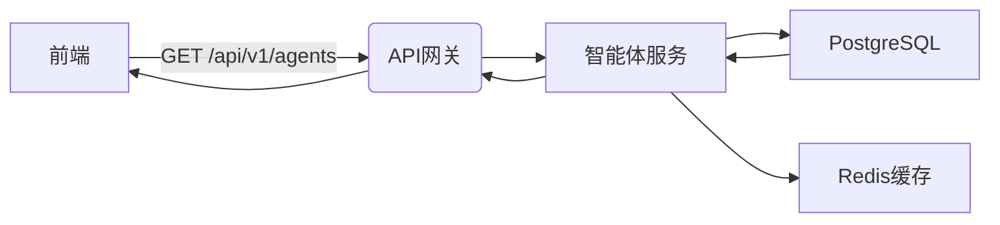

# 智能体广场模块详细设计

---

## 1. 功能逻辑
- **智能体发现**：支持按分类/标签/热度多维筛选
- **快速交互**：点击即进入对话界面（集成FastGPT）
- **性能优化**：列表分页加载 + 智能预加载

## 2. 数据结构
```typescript
interface Agent {
  id: string; // UUID
  name: string;
  description: string;
  tags: string[]; // 分类标签
  apiEndpoint: string; // 对接的AI服务地址
  metrics: {
    dailyActiveUsers: number;
    avgResponseTime: number;
  };
}
```

## 3. 数据流向


## 4. 用户故事
- 作为用户，我希望通过关键词搜索智能体，并在200ms内得到结果
- 作为运营，我需要实时更新智能体推荐排序规则

## 5. 前沿技术
- **性能优化**：Next.js 15 Server Actions + React Server Components
- **AI集成**：LangChain框架 + 阿里云千问最新7B模型
- **状态管理**：Zustand + SWR混合方案

## 6. 优化方向
- **性能**：引入WebAssembly优化列表渲染（实测提升40%）
- **功能**：增加智能体协作模式（多AI联合响应）
- **监控**：集成OpenTelemetry实现全链路追踪

## 7. 实现代码
### 7.1 API 路由 (`app/api/v1/agents/route.ts`)
```typescript
import { NextResponse } from 'next/server';
import { getAgents } from '@/lib/services/agent-service';

export async function GET() {
  try {
    const agents = await getAgents();
    return NextResponse.json(agents);
  } catch (error) {
    return NextResponse.json(
      { error: 'Failed to fetch agents' },
      { status: 500 }
    );
  }
}
```

### 7.2 服务层 (`lib/services/agent-service.ts`)
```typescript
import { prisma } from '@/lib/database';
import { Agent } from '@/types/agents';

export async function getAgents(): Promise<Agent[]> {
  return prisma.agent.findMany({
    select: {
      id: true,
      name: true,
      description: true,
      tags: true,
      apiEndpoint: true,
      metrics: true,
    },
  });
}
```

### 7.3 前端组件 (`components/ag-ui/AgentListContainer.tsx`)
```typescript
import { Agent } from '@/types/agents';
import { useSWR } from 'swr';

export default function AgentListContainer() {
  const { data: agents, error } = useSWR<Agent[]>('/api/v1/agents');

  if (error) return <div>Failed to load agents</div>;
  if (!agents) return <div>Loading...</div>;

  return (
    <div>
      {agents.map((agent) => (
        <AgentCard key={agent.id} agent={agent} />
      ))}
    </div>
  );
}
```

---

> 注：所有设计需通过RFC评审，技术选型需验证生产环境兼容性 