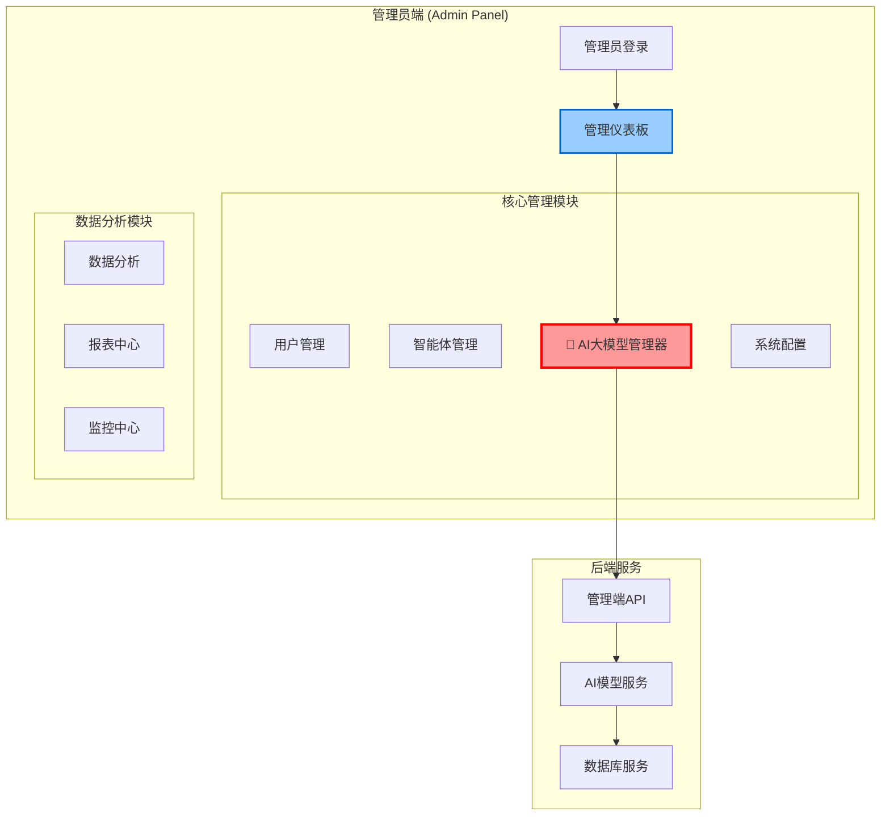

# AI大模型管理器规范文档

## 📍 功能定位说明

**AI大模型管理器是管理员端的核心功能模块，专门用于管理和监控所有AI模型资源。**

---

## 🔧 管理端专属功能

### 1. 功能归属
- **🎯 归属位置**: 管理员端 (`/admin/dashboard/ai-models`)
- **👥 使用对象**: 仅限管理员用户
- **🔐 权限要求**: 需要管理员认证和相应权限

### 2. 核心功能模块

#### 2.1 AI提供商管理
```typescript
// 管理端专用 - AI提供商配置
interface AIProviderManagement {
  // CRUD操作
  create: (provider: AIProviderCreateRequest) => Promise<AIProvider>;
  update: (id: string, updates: AIProviderUpdateRequest) => Promise<AIProvider>;
  delete: (id: string) => Promise<void>;
  list: () => Promise<AIProvider[]>;
  
  // 连接测试
  testConnection: (id: string) => Promise<ConnectionTestResult>;
  
  // 配置管理
  updateApiKey: (id: string, apiKey: string) => Promise<void>;
  updateEndpoint: (id: string, endpoint: string) => Promise<void>;
}
```

#### 2.2 AI模型配置管理
```typescript
// 管理端专用 - AI模型配置
interface AIModelManagement {
  // 模型管理
  createModel: (model: AIModelCreateRequest) => Promise<AIModel>;
  updateModel: (id: string, updates: AIModelUpdateRequest) => Promise<AIModel>;
  enableModel: (id: string) => Promise<void>;
  disableModel: (id: string) => Promise<void>;
  
  // 参数调优
  updateParameters: (id: string, params: ModelParameters) => Promise<void>;
  setBatchSize: (id: string, batchSize: number) => Promise<void>;
  setRateLimit: (id: string, rateLimit: RateLimitConfig) => Promise<void>;
}
```

#### 2.3 使用统计与监控
```typescript
// 管理端专用 - 模型监控
interface AIModelMonitoring {
  // 实时监控
  getRealTimeStats: () => Promise<RealTimeModelStats>;
  getModelHealth: (modelId: string) => Promise<ModelHealthStatus>;
  
  // 历史统计
  getUsageHistory: (params: UsageHistoryParams) => Promise<UsageStats[]>;
  getPerformanceMetrics: (modelId: string, timeRange: TimeRange) => Promise<PerformanceMetrics>;
  
  // 成本分析
  getCostAnalysis: (timeRange: TimeRange) => Promise<CostAnalysis>;
  getCostByProvider: () => Promise<ProviderCostBreakdown>;
}
```

#### 2.4 告警与通知
```typescript
// 管理端专用 - 告警管理
interface AIModelAlerting {
  // 告警配置
  setUsageAlert: (modelId: string, threshold: number) => Promise<void>;
  setCostAlert: (threshold: number) => Promise<void>;
  setErrorRateAlert: (modelId: string, threshold: number) => Promise<void>;
  
  // 通知管理
  getAlertHistory: () => Promise<Alert[]>;
  acknowledgeAlert: (alertId: string) => Promise<void>;
}
```

---

## 🏗️ 系统架构中的位置

### 管理端架构图


---

## 🛡️ 权限控制体系

### 权限级别定义
```typescript
enum AIModelPermissions {
  // 查看权限
  AI_MODEL_VIEW = 'ai_model:view',           // 查看模型列表和基本信息
  AI_MODEL_STATS = 'ai_model:stats',         // 查看使用统计
  
  // 管理权限
  AI_MODEL_CREATE = 'ai_model:create',       // 创建新模型配置
  AI_MODEL_UPDATE = 'ai_model:update',       // 更新模型配置
  AI_MODEL_DELETE = 'ai_model:delete',       // 删除模型配置
  
  // 提供商管理
  AI_PROVIDER_MANAGE = 'ai_provider:manage', // 管理AI提供商
  AI_PROVIDER_CONFIG = 'ai_provider:config', // 配置提供商API
  
  // 高级功能
  AI_MODEL_DEPLOY = 'ai_model:deploy',       // 部署和停用模型
  AI_MODEL_MONITOR = 'ai_model:monitor',     // 高级监控功能
  AI_COST_MANAGE = 'ai_cost:manage',         // 成本管理和预算控制
}
```

### 角色权限映射
```typescript
const RolePermissions = {
  'super_admin': [
    // 拥有所有AI模型管理权限
    ...Object.values(AIModelPermissions)
  ],
  
  'admin': [
    AIModelPermissions.AI_MODEL_VIEW,
    AIModelPermissions.AI_MODEL_STATS,
    AIModelPermissions.AI_MODEL_UPDATE,
    AIModelPermissions.AI_PROVIDER_MANAGE
  ],
  
  'operator': [
    AIModelPermissions.AI_MODEL_VIEW,
    AIModelPermissions.AI_MODEL_STATS
  ]
};
```

---

## 📊 管理端界面设计

### 主界面布局
```
┌─────────────────────────────────────────────────┐
│ 管理员端 - AI大模型管理器                          │
├─────────────────────────────────────────────────┤
│ 📊 概览面板                                     │
│ ┌─────────┬─────────┬─────────┬─────────┐       │
│ │ 模型总数  │ 活跃模型  │ 今日请求  │ 月度成本  │       │
│ │   12    │    8    │  2.3K   │ $245   │       │
│ └─────────┴─────────┴─────────┴─────────┘       │
├─────────────────────────────────────────────────┤
│ 🔧 提供商管理                                   │
│ ┌─────────────────────────────────────────────┐ │
│ │ FastGPT    [●在线]  [配置] [测试] [统计]    │ │
│ │ 阿里云千问  [●在线]  [配置] [测试] [统计]    │ │
│ │ 硅基流动   [○离线]  [配置] [测试] [统计]    │ │
│ └─────────────────────────────────────────────┘ │
├─────────────────────────────────────────────────┤
│ 🤖 模型管理                                     │
│ ┌─────────────────────────────────────────────┐ │
│ │ 模型名称    提供商    状态    请求数   成本   │ │
│ │ gpt-4o     FastGPT   运行中   1.2K    $120  │ │
│ │ qwen-max   阿里云    运行中    800     $45   │ │
│ │ yi-large   硅基流动  已停用    0       $0    │ │
│ └─────────────────────────────────────────────┘ │
└─────────────────────────────────────────────────┘
```

### 功能导航
```
管理员端 > 仪表板 > AI大模型管理器
├── 📊 概览
├── 🔧 提供商管理
│   ├── 添加提供商
│   ├── 配置管理
│   └── 连接测试
├── 🤖 模型管理
│   ├── 模型配置
│   ├── 参数调优
│   └── 启用/禁用
├── 📈 监控分析
│   ├── 实时监控
│   ├── 使用统计
│   └── 成本分析
└── ⚠️ 告警设置
    ├── 阈值配置
    └── 通知管理
```

---

## 🔗 API端点设计 (管理端专用)

### 基础路径
```
/api/admin/ai-models/*  // 所有AI模型管理API都在admin路径下
```

### 完整API列表
```typescript
// 管理端专用API端点
const AdminAIModelAPI = {
  // 提供商管理
  'GET    /api/admin/ai-providers': '获取提供商列表',
  'POST   /api/admin/ai-providers': '创建提供商',
  'PUT    /api/admin/ai-providers/:id': '更新提供商',
  'DELETE /api/admin/ai-providers/:id': '删除提供商',
  'POST   /api/admin/ai-providers/:id/test': '测试连接',
  
  // 模型管理
  'GET    /api/admin/ai-models': '获取模型列表',
  'POST   /api/admin/ai-models': '创建模型配置',
  'PUT    /api/admin/ai-models/:id': '更新模型配置',
  'DELETE /api/admin/ai-models/:id': '删除模型',
  'POST   /api/admin/ai-models/:id/toggle': '启用/禁用模型',
  
  // 监控统计
  'GET    /api/admin/ai-models/stats': '获取总体统计',
  'GET    /api/admin/ai-models/:id/stats': '获取单个模型统计',
  'GET    /api/admin/ai-models/usage-history': '获取使用历史',
  'GET    /api/admin/ai-models/cost-analysis': '获取成本分析',
  
  // 告警管理
  'GET    /api/admin/ai-models/alerts': '获取告警列表',
  'POST   /api/admin/ai-models/alerts': '创建告警规则',
  'PUT    /api/admin/ai-models/alerts/:id': '更新告警规则',
  'DELETE /api/admin/ai-models/alerts/:id': '删除告警规则',
};
```

---

## ⚡ 关键特性

### 1. 安全性
- **🔐 多层认证**: 管理员登录 + 操作权限验证
- **🛡️ 数据加密**: API密钥加密存储
- **📋 操作审计**: 所有操作记录审计日志

### 2. 可靠性
- **⚡ 实时监控**: 模型状态实时监测
- **🔄 自动恢复**: 故障自动检测和恢复
- **📊 性能优化**: 自动负载均衡和优化

### 3. 易用性
- **🎨 直观界面**: 清晰的管理界面设计
- **📱 响应式**: 支持多设备访问
- **🔍 智能搜索**: 快速查找和筛选功能

---

## 📋 实施清单

### ✅ 开发阶段
- [ ] 管理端认证和权限系统
- [ ] AI提供商CRUD接口
- [ ] AI模型配置管理界面
- [ ] 实时监控和统计功能
- [ ] 成本分析和告警系统

### ✅ 测试验证
- [ ] 权限控制测试
- [ ] API功能测试
- [ ] 界面交互测试
- [ ] 性能压力测试
- [ ] 安全渗透测试

### ✅ 部署上线
- [ ] 生产环境配置
- [ ] 数据迁移脚本
- [ ] 监控告警配置
- [ ] 备份恢复策略
- [ ] 运维文档完善

---

## 🎯 总结

**AI大模型管理器是管理员端的核心功能，专门为管理员提供全方位的AI模型管理能力。它不是用户端功能，而是管理员专用的系统管理工具，用于配置、监控和优化整个AI智能体平台的模型资源。**

### 核心定位
- **🏢 管理端专属**: 仅供管理员使用
- **🔧 系统级管理**: 管理整个平台的AI资源
- **📊 数据驱动**: 基于数据进行决策和优化
- **🛡️ 安全可控**: 严格的权限控制和审计机制 