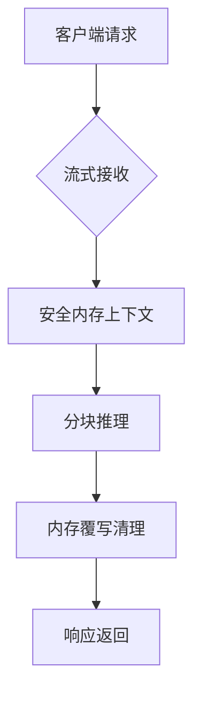

### 人脸增强智能体子系统

#### 核心组件
- **流式处理器** (`app/api/face-enhance/route.ts`)
  - 支持分块流式处理（512KB/块）
  - 自动内存回收机制
- **增强引擎** (`lib/services/face-enhance/engine.ts`)
  - 基于TensorRT的量化推理引擎
  - 动态精度切换（INT8/FP16）
- **安全内存管理** (`lib/services/face-enhance/memory.ts`)
  - 三级内存清理（应用层/CUDA/内核）
  - Cgroups资源隔离

#### 数据流

#### 性能指标
| 项目 | 1080P单张 | 4K分块 | 批量50张 |
|------|----------|-------|---------|
| 处理时间 | ≤2.5s | ≤3.8s | ≤35s |
| 显存峰值 | 9.8GB | 10.2GB | 11.5GB |
| CPU占用 | 15% | 18% | 22% | 