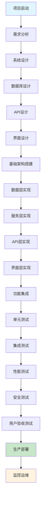
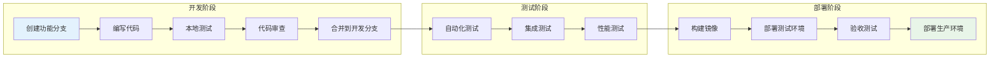
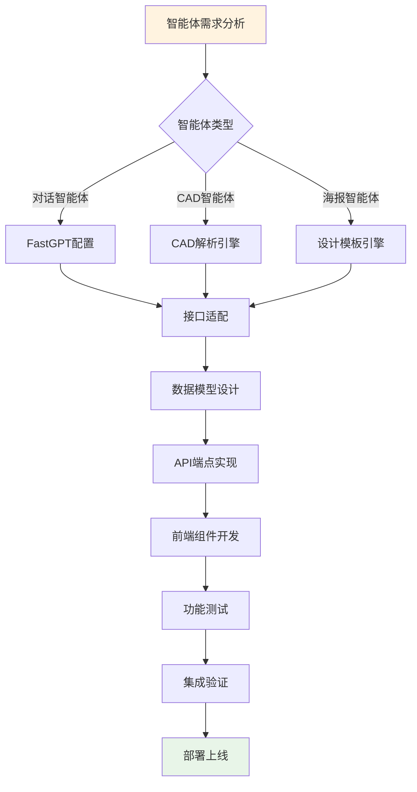
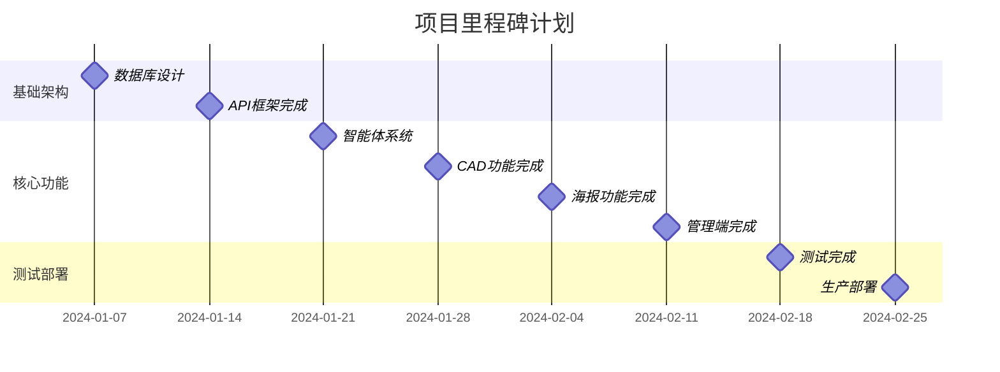
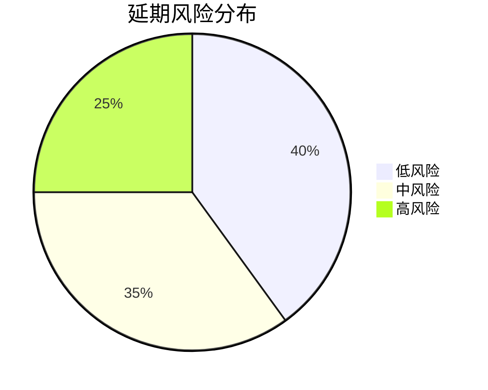
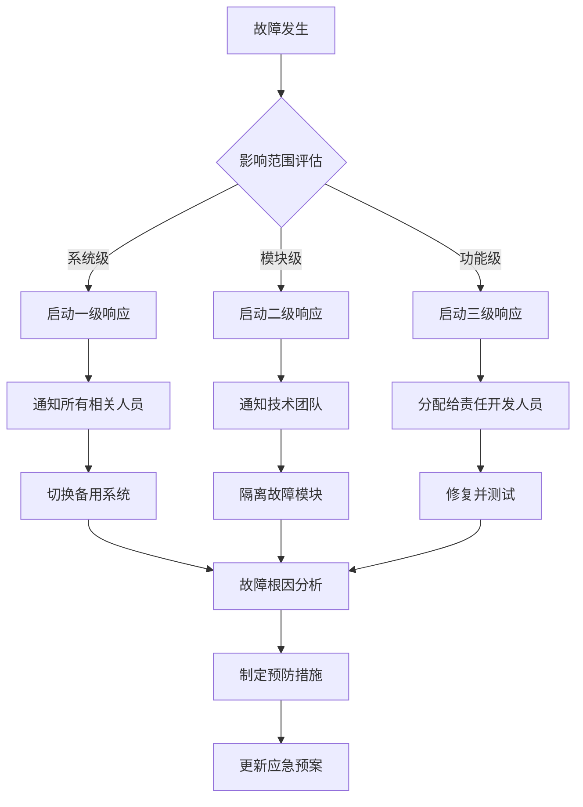

# 开发工作流程图与实施清单

## 目录
1. [开发工作流程图](#1-开发工作流程图)
2. [任务分解与检查清单](#2-任务分解与检查清单)
3. [里程碑计划](#3-里程碑计划)
4. [风险管控](#4-风险管控)

---

## 1. 开发工作流程图

### 1.1 完整开发工作流



### 1.2 代码开发流程



### 1.3 智能体集成流程



---

## 2. 任务分解与检查清单

### 2.1 阶段一：基础架构搭建（第1-2周）

#### 第1周任务清单

**数据库设计与实现**
- [ ] 设计数据库ER图
- [ ] 创建PostgreSQL数据库结构
- [ ] 设置数据库连接池
- [ ] 创建初始化SQL脚本
- [ ] 配置数据库备份策略

```sql
-- 检查点：数据库创建验证
SELECT table_name 
FROM information_schema.tables 
WHERE table_schema = 'public';

-- 应该包含以下表：
-- users, admin_users, ai_providers, ai_models
-- agents, agent_categories, fastgpt_agents
-- conversations, messages, cad_files, cad_analyses
```

**基础类型定义**
- [ ] 创建核心数据类型 (`types/core/index.ts`)
- [ ] 创建智能体类型 (`types/agents/index.ts`)
- [ ] 创建对话类型 (`types/chat/index.ts`)
- [ ] 创建CAD类型 (`types/cad/index.ts`)
- [ ] 创建API类型 (`types/api/index.ts`)

```typescript
// 检查点：类型导入验证
import { User, Agent, Conversation, CADFile, APIResponse } from '@/types';
// 所有类型应该正确导入无错误
```

**API路由框架**
- [ ] 设置Next.js 15 App Router结构
- [ ] 创建API路由基础框架
- [ ] 实现统一的错误处理中间件
- [ ] 配置CORS和安全头
- [ ] 设置API文档生成

```typescript
// 检查点：API路由测试
// GET /api/health 应该返回 200 状态
// GET /api/system/status 应该返回系统信息
```

**认证系统**
- [ ] 实现JWT令牌生成和验证
- [ ] 创建设备ID识别机制
- [ ] 实现管理员认证中间件
- [ ] 配置会话管理
- [ ] 设置密码加密策略

#### 第2周任务清单

**核心服务层实现**
- [ ] 创建数据库服务抽象层
- [ ] 实现用户服务 (`lib/services/user-service.ts`)
- [ ] 实现智能体服务 (`lib/services/agent-service.ts`)
- [ ] 实现对话服务 (`lib/services/chat-service.ts`)
- [ ] 创建缓存服务 (`lib/services/cache-service.ts`)

```typescript
// 检查点：服务层测试
const userService = UserService.getInstance();
const user = await userService.createUser({ deviceId: 'test-device' });
expect(user.id).toBeDefined();
```

**基础UI组件库**
- [ ] 设置Tailwind CSS配置
- [ ] 创建基础UI组件 (`components/ui/`)
- [ ] 实现响应式布局组件
- [ ] 创建Loading和Error组件
- [ ] 实现主题切换功能

**错误处理机制**
- [ ] 创建全局错误处理器
- [ ] 实现错误边界组件
- [ ] 设置错误日志收集
- [ ] 创建用户友好的错误提示
- [ ] 配置错误恢复机制

**日志系统**
- [ ] 配置结构化日志格式
- [ ] 实现日志分级 (info, warn, error)
- [ ] 设置日志轮转策略
- [ ] 配置敏感信息过滤
- [ ] 集成监控告警

### 2.2 阶段二：核心功能开发（第3-6周）

#### 第3周：智能体管理与对话功能

**智能体管理系统**
- [ ] 实现智能体CRUD操作API
- [ ] 创建智能体配置管理界面
- [ ] 实现智能体分类管理
- [ ] 添加智能体状态管理
- [ ] 创建智能体使用统计

```typescript
// 检查点：智能体管理验证
const agent = await agentService.createAgent({
  name: '测试智能体',
  type: 'chat',
  config: {}
});
expect(agent.id).toBeDefined();
```

**FastGPT集成**
- [ ] 实现FastGPT API客户端
- [ ] 创建智能体配置映射
- [ ] 实现流式对话功能
- [ ] 添加对话历史管理
- [ ] 集成语音功能支持

**基础对话功能**
- [ ] 创建对话界面组件
- [ ] 实现消息发送和接收
- [ ] 添加消息类型支持 (文本/图片/语音)
- [ ] 实现对话会话管理
- [ ] 创建对话历史查询

#### 第4周：CAD文件处理

**CAD文件上传和解析**
- [ ] 实现文件上传API
- [ ] 创建文件类型检测机制
- [ ] 实现DWG文件解析器
- [ ] 实现STEP文件解析器
- [ ] 实现IGES文件解析器

```typescript
// 检查点：文件上传验证
const file = await cadService.uploadFile(fileBuffer, 'test.dwg');
expect(file.status).toBe('processing');
```

**3D渲染组件**
- [ ] 集成Three.js渲染引擎
- [ ] 创建3D模型查看器
- [ ] 实现模型交互控制
- [ ] 添加渲染性能优化
- [ ] 实现缩略图生成

**文件存储系统**
- [ ] 配置文件存储服务
- [ ] 实现文件安全访问控制
- [ ] 设置文件清理策略
- [ ] 实现文件版本管理
- [ ] 配置CDN加速

#### 第5周：AI分析与海报生成

**AI分析引擎集成**
- [ ] 集成阿里云千问API
- [ ] 实现CAD文件智能分析
- [ ] 创建分析结果存储机制
- [ ] 实现分析报告生成
- [ ] 添加分析质量评估

**海报生成功能**
- [ ] 集成硅基流动API
- [ ] 创建海报模板管理
- [ ] 实现AI驱动的设计生成
- [ ] 添加设计风格配置
- [ ] 实现海报导出功能

**模板管理系统**
- [ ] 创建模板存储结构
- [ ] 实现模板分类管理
- [ ] 添加模板预览功能
- [ ] 创建模板评分系统
- [ ] 实现模板推荐算法

#### 第6周：管理端功能

**管理端界面**
- [ ] 创建管理员登录页面
- [ ] 实现仪表板概览
- [ ] 创建智能体管理界面
- [ ] **实现AI模型管理器界面（管理端核心功能）**
  - [ ] AI提供商配置管理
  - [ ] AI模型参数配置
  - [ ] 模型使用统计和监控
  - [ ] 成本分析和预警
- [ ] 添加系统设置页面

**数据分析功能**
- [ ] 实现用户行为分析
- [ ] 创建使用统计报表
- [ ] **AI模型性能分析报表**
- [ ] 实现地理热点图
- [ ] 添加性能监控面板
- [ ] 创建错误日志查看

**用户权限管理**
- [ ] 实现角色权限系统
- [ ] 创建权限分配界面
- [ ] 添加操作审计日志
- [ ] 实现权限验证中间件
- [ ] 创建权限异常处理

### 2.3 阶段三：优化和测试（第7-8周）

#### 第7周：性能优化与安全加固

**性能优化**
- [ ] 实现数据库查询优化
- [ ] 添加Redis缓存策略
- [ ] 优化前端资源加载
- [ ] 实现API响应压缩
- [ ] 配置CDN缓存策略

```bash
# 检查点：性能指标验证
# API响应时间 < 500ms
# 页面加载时间 < 3s
# 数据库查询时间 < 100ms
```

**安全加固**
- [ ] 实现输入数据验证
- [ ] 添加SQL注入防护
- [ ] 配置XSS防护策略
- [ ] 实现CSRF令牌验证
- [ ] 设置安全头配置

**单元测试**
- [ ] 创建服务层单元测试
- [ ] 实现组件单元测试
- [ ] 添加工具函数测试
- [ ] 创建API端点测试
- [ ] 配置测试覆盖率报告

#### 第8周：集成测试与部署准备

**集成测试**
- [ ] 创建端到端测试场景
- [ ] 实现API集成测试
- [ ] 添加数据库集成测试
- [ ] 创建智能体功能测试
- [ ] 实现性能基准测试

**用户体验优化**
- [ ] 优化界面响应速度
- [ ] 改进错误提示信息
- [ ] 实现操作反馈机制
- [ ] 添加帮助文档系统
- [ ] 优化移动端体验

**文档完善**
- [ ] 更新API文档
- [ ] 创建部署指南
- [ ] 编写运维手册
- [ ] 完善开发文档
- [ ] 创建用户使用指南

---

## 3. 里程碑计划

### 3.1 里程碑定义



### 3.2 里程碑验收标准

#### M1: 数据库设计完成
- [ ] 所有数据库表创建成功
- [ ] 外键关系正确建立
- [ ] 索引策略实施到位
- [ ] 初始数据成功导入
- [ ] 备份恢复机制验证

#### M2: API框架完成
- [ ] 所有API路由正常响应
- [ ] 认证授权机制正常工作
- [ ] 错误处理统一规范
- [ ] 文档自动生成功能
- [ ] 基础监控指标收集

#### M3: 智能体系统完成
- [ ] 智能体CRUD操作正常
- [ ] FastGPT集成功能验证
- [ ] 对话流程完整测试
- [ ] 语音功能正常工作
- [ ] 会话管理功能验证

#### M4: CAD功能完成
- [ ] 支持格式文件正常解析
- [ ] 3D渲染功能正常显示
- [ ] AI分析结果准确性验证
- [ ] 文件存储安全性测试
- [ ] 性能指标达到要求

#### M5: 海报功能完成
- [ ] AI海报生成功能正常
- [ ] 模板管理系统完整
- [ ] 导出功能正常工作
- [ ] 样式配置功能验证
- [ ] 用户体验流程顺畅

#### M6: 管理端完成
- [ ] 管理员认证登录正常
- [ ] 智能体管理功能完整
- [ ] 数据分析报表准确
- [ ] 权限控制机制有效
- [ ] 系统监控功能正常

#### M7: 测试完成
- [ ] 单元测试覆盖率>80%
- [ ] 集成测试全部通过
- [ ] 性能测试达标
- [ ] 安全测试无高危漏洞
- [ ] 用户验收测试通过

#### M8: 生产部署
- [ ] 生产环境部署成功
- [ ] 监控告警系统正常
- [ ] 备份恢复策略验证
- [ ] 负载均衡配置正确
- [ ] 灾难恢复预案完整

---

## 4. 风险管控

### 4.1 技术风险识别与应对

#### 高风险项

**1. AI API集成风险**
- **风险描述**: FastGPT、阿里云千问、硅基流动API稳定性
- **影响程度**: 高
- **应对策略**: 
  - 实现API调用重试机制
  - 设计降级方案
  - 多供应商备选方案
  - 实现缓存策略减少API依赖

**2. CAD文件解析复杂性**
- **风险描述**: 不同CAD格式兼容性问题
- **影响程度**: 高  
- **应对策略**:
  - 分阶段支持文件格式
  - 引入成熟的解析库
  - 详细的错误处理和用户提示
  - 提供格式转换建议

**3. 3D渲染性能问题**
- **风险描述**: 大文件渲染导致浏览器卡顿
- **影响程度**: 中高
- **应对策略**:
  - 实现LOD (细节层次) 技术
  - 添加文件大小限制
  - 使用Web Workers处理复杂计算
  - 提供渲染质量选项

#### 中风险项

**4. 数据库性能瓶颈**
- **风险描述**: 大量并发请求导致数据库压力
- **影响程度**: 中
- **应对策略**:
  - 实现数据库连接池
  - 添加Redis缓存层
  - 优化数据库索引
  - 实现读写分离

**5. 文件存储空间管理**
- **风险描述**: CAD文件和海报文件占用存储空间快速增长
- **影响程度**: 中
- **应对策略**:
  - 实现文件生命周期管理
  - 配置自动清理策略
  - 使用对象存储服务
  - 实现文件压缩算法

### 4.2 项目风险管控

#### 进度风险

**延期风险评估**


**应对措施**:
- [ ] 每周进度评估会议
- [ ] 关键路径识别和优化
- [ ] 资源动态调配机制
- [ ] 备选方案准备

#### 质量风险

**质量控制检查点**:
- [ ] 代码review必须率100%
- [ ] 自动化测试覆盖率>80%
- [ ] 性能基准测试必须通过
- [ ] 安全扫描零高危漏洞

### 4.3 应急预案

#### 技术故障应急响应



#### 数据安全应急响应

**数据泄露应急流程**:
1. **立即响应** (0-1小时)
   - [ ] 停止可疑活动
   - [ ] 保护现场证据
   - [ ] 通知安全团队

2. **评估影响** (1-4小时)
   - [ ] 确定泄露范围
   - [ ] 评估数据敏感程度
   - [ ] 制定应对策略

3. **修复加固** (4-24小时)
   - [ ] 修复安全漏洞
   - [ ] 更新安全配置
   - [ ] 实施额外监控

4. **后续跟进** (1-7天)
   - [ ] 完整的事件报告
   - [ ] 安全改进建议
   - [ ] 员工安全培训

---

## 总结

本开发工作流程图与实施清单提供了详细的项目执行指导，包括：

1. **完整的工作流程图**：从项目启动到生产部署的全流程
2. **详细的任务清单**：每周具体的执行任务和验证标准  
3. **明确的里程碑计划**：8个关键里程碑和验收标准
4. **全面的风险管控**：技术风险识别和应急预案

通过严格遵循这个工作流程和检查清单，可以确保项目按时、按质、按要求完成交付。 