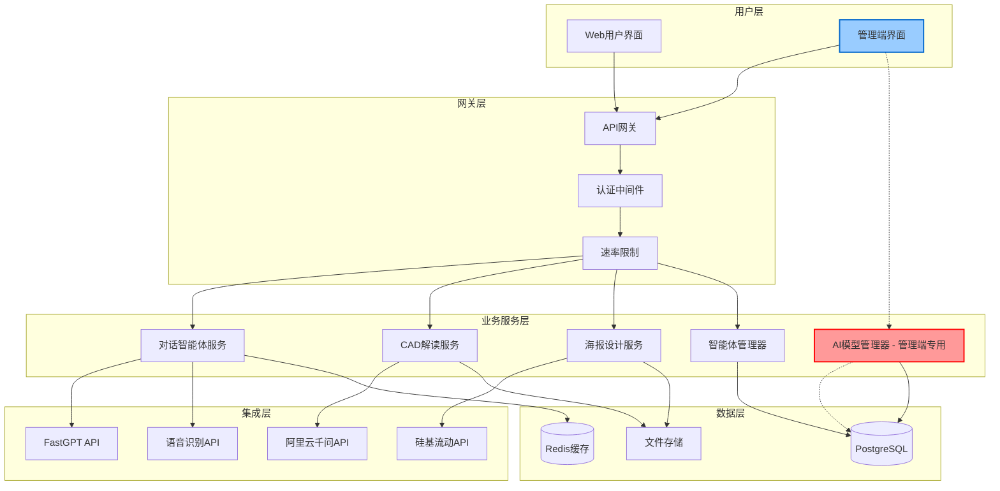

# 项目开发规范 - 核心遵守规则

## 📋 文档说明

**本文档是AI智能体项目的核心开发规范，所有开发人员必须熟知并严格遵守。**

---

## 🎯 项目概览

### 项目定位
- **项目名称**: AI智能体平台 (ai-chat-interface)
- **技术栈**: Next.js 15 + React 18 + TypeScript + PostgreSQL + Redis
- **交付标准**: 生产级别高端交付水平
- **开发要求**: 系统级别梳理、规范严格遵守、全局一致性

### 核心功能模块
1. **对话智能体** - 统一界面选择不同FastGPT智能体
2. **CAD解读智能体** - 独立界面，支持文件上传、3D渲染、智能分析  
3. **海报设计智能体** - 独立界面，AI驱动的创意海报生成
4. **管理端** - 智能体配置管理、**AI大模型管理器（管理端专属）**、数据分析

---

## 🏗️ 技术架构规范

### 系统架构层次


### 项目结构标准
```
project-root/
├── app/                          # Next.js 15 App Router
│   ├── (public)/                 # 公开页面组
│   │   ├── page.tsx             # 首页
│   │   ├── chat/                # 对话智能体
│   │   ├── cad-analyzer/        # CAD解读
│   │   └── poster-generator/    # 海报设计
│   ├── admin/                   # 管理端页面
│   │   ├── layout.tsx           # 管理端布局
│   │   ├── login/               # 登录页
│   │   ├── dashboard/           # 仪表板
│   │   │   ├── agents/          # 智能体管理
│   │   │   ├── ai-models/       # 🎯 AI大模型管理器（管理端核心）
│   │   │   ├── analytics/       # 数据分析
│   │   │   └── settings/        # 系统设置
│   └── api/                     # API路由
│       ├── ag-ui/               # 用户端API
│       ├── admin/               # 管理端API
│       │   ├── ai-providers/    # AI提供商管理API
│       │   ├── ai-models/       # AI模型管理API
│       │   └── analytics/       # 数据分析API
│       └── system/              # 系统API
├── components/                   # 组件库
│   ├── ui/                      # 基础UI组件
│   ├── chat/                    # 对话相关组件
│   ├── cad/                     # CAD相关组件
│   ├── poster/                  # 海报相关组件
│   └── admin/                   # 管理端组件
│       └── ai-models/           # 🎯 AI模型管理组件
├── lib/                         # 核心库
│   ├── services/                # 业务服务
│   │   ├── agent-service.ts     # 智能体服务
│   │   ├── ai-model-service.ts  # 🎯 AI模型管理服务（管理端）
│   │   └── admin-service.ts     # 管理端服务
│   ├── api/                     # API客户端
│   ├── utils/                   # 工具函数
│   ├── hooks/                   # 自定义Hooks
│   ├── stores/                  # 状态管理
│   └── database/                # 数据库
├── types/                       # 类型定义
│   ├── core/                    # 核心类型
│   ├── agents/                  # 智能体类型
│   ├── chat/                    # 对话类型
│   ├── cad/                     # CAD类型
│   ├── api/                     # API类型
│   └── admin/                   # 管理端类型
└── config/                      # 配置文件
    ├── database.ts              # 数据库配置
    ├── ai-providers.ts          # AI提供商配置
    └── constants.ts             # 常量定义
```

---

## 🚦 核心功能定位规范

### AI大模型管理器 - 管理端专属规范

> **⚠️ 重要：AI大模型管理器是管理端专属功能，不得在用户端实现或暴露！**

#### 功能归属明确性
- **🎯 归属位置**: `/admin/dashboard/ai-models`
- **👥 使用对象**: 仅限管理员用户
- **🔐 权限要求**: 需要管理员认证 + 相应权限
- **🚫 严禁混淆**: 不得在用户端出现任何AI模型管理功能

#### 核心功能边界
```typescript
// ✅ 管理端专用功能
interface AIModelManagerFeatures {
  // AI提供商管理
  providerManagement: {
    crud: boolean;           // 创建、读取、更新、删除提供商
    connectionTest: boolean; // 测试API连接
    configManagement: boolean; // 配置管理
  };
  
  // AI模型配置
  modelConfiguration: {
    parameterTuning: boolean;  // 参数调优
    enableDisable: boolean;    // 启用/禁用模型
    batchSizeConfig: boolean;  // 批次大小配置
    rateLimitConfig: boolean;  // 速率限制配置
  };
  
  // 监控分析
  monitoring: {
    realTimeStats: boolean;    // 实时统计
    usageHistory: boolean;     // 使用历史
    costAnalysis: boolean;     // 成本分析
    performanceMetrics: boolean; // 性能指标
  };
  
  // 告警管理
  alerting: {
    thresholdConfig: boolean;  // 阈值配置
    notificationMgmt: boolean; // 通知管理
    alertHistory: boolean;     // 告警历史
  };
}

// ❌ 用户端严禁出现的功能
interface ProhibitedInUserSide {
  aiProviderConfig: never;     // 用户端不得配置AI提供商
  modelParameters: never;      // 用户端不得调整模型参数
  costManagement: never;       // 用户端不得查看成本信息
  systemLevelConfig: never;    // 用户端不得进行系统级配置
}
```

#### API路径规范
```typescript
// ✅ 正确：管理端API路径
const AdminAIModelAPI = {
  'GET    /api/admin/ai-providers': '管理端获取提供商',
  'POST   /api/admin/ai-providers': '管理端创建提供商',
  'GET    /api/admin/ai-models': '管理端获取模型',
  'POST   /api/admin/ai-models': '管理端创建模型',
  'GET    /api/admin/ai-models/stats': '管理端查看统计',
  'GET    /api/admin/ai-models/cost-analysis': '管理端成本分析'
};

// ❌ 错误：用户端不得出现这些路径
const ProhibitedUserAPI = {
  'GET    /api/ag-ui/ai-models': '❌ 严禁在用户端暴露',
  'GET    /api/models/config': '❌ 严禁在用户端暴露',
  'POST   /api/user/ai-provider': '❌ 严禁在用户端暴露'
};
```

### 其他功能边界
- **对话智能体**: 用户端功能，但配置管理在管理端
- **CAD解读智能体**: 用户端功能，但智能体配置在管理端
- **海报设计智能体**: 用户端功能，但模板管理在管理端
- **用户管理**: 管理端专属功能
- **数据分析**: 管理端专属功能

---

## 📝 代码规范标准

### TypeScript编码规范
```typescript
// 1. 严格模式配置
{
  "compilerOptions": {
    "strict": true,
    "noImplicitAny": true,
    "noImplicitReturns": true,
    "noImplicitThis": true,
    "strictNullChecks": true
  }
}

// 2. 命名规范
interface NamingStandards {
  // 文件命名：kebab-case
  files: 'ai-model-service.ts' | 'admin-dashboard.tsx';
  
  // 组件命名：PascalCase
  components: 'AIModelManager' | 'ChatInterface';
  
  // 变量和函数：camelCase
  variables: 'aiModelConfig' | 'getProviderStats';
  
  // 常量：SCREAMING_SNAKE_CASE
  constants: 'AI_MODEL_PERMISSIONS' | 'ADMIN_ROUTES';
  
  // 类型和接口：PascalCase
  types: 'AIProvider' | 'AdminUser' | 'ModelConfiguration';
}

// 3. 接口定义规范
interface ServiceInterface {
  // 所有方法必须有明确的返回类型
  getModel(id: string): Promise<AIModel>;
  updateModel(id: string, updates: Partial<AIModel>): Promise<AIModel>;
  
  // 错误处理必须统一
  handleError(error: unknown): ServiceError;
}

// 4. 组件开发规范
const ExampleComponent: React.FC<ComponentProps> = ({
  // 1. Props解构
  requiredProp,
  optionalProp = 'defaultValue'
}) => {
  // 2. 状态定义
  const [state, setState] = useState<StateType>(initialState);
  
  // 3. 计算属性
  const computedValue = useMemo(() => {
    return expensiveCalculation(state);
  }, [state]);
  
  // 4. 事件处理
  const handleEvent = useCallback((event: Event) => {
    // 事件处理逻辑
  }, [dependency]);
  
  // 5. 渲染
  return <div>{/* JSX */}</div>;
};
```

### 错误处理规范
```typescript
// 统一错误处理接口
interface ServiceError {
  code: string;
  message: string;
  details?: any;
  timestamp: string;
}

// API错误处理
class APIError extends Error {
  constructor(
    public code: string,
    message: string,
    public details?: any
  ) {
    super(message);
    this.name = 'APIError';
  }
}

// 服务层错误处理
class ServiceBase {
  protected handleError(error: unknown): ServiceError {
    if (error instanceof APIError) {
      return {
        code: error.code,
        message: error.message,
        details: error.details,
        timestamp: new Date().toISOString()
      };
    }
    
    return {
      code: 'UNKNOWN_ERROR',
      message: 'An unexpected error occurred',
      timestamp: new Date().toISOString()
    };
  }
}
```

---

## 🔄 开发工作流规范

### Git工作流标准
```bash
# 分支命名规范
main                           # 生产环境分支
develop                        # 开发环境分支
feature/ai-model-manager       # 功能分支
feature/cad-analyzer          # CAD功能分支
hotfix/critical-security-fix  # 紧急修复分支
release/v1.0.0                # 发布分支

# 提交信息规范
feat(admin): 添加AI模型管理器界面
fix(chat): 修复消息发送失败问题
docs(api): 更新AI模型管理API文档
style(ui): 调整管理端布局样式
refactor(service): 重构智能体服务逻辑
test(admin): 添加AI模型管理器测试用例
chore(build): 更新依赖包版本

# 代码审查要求
- 所有代码必须通过代码审查
- 管理端功能必须有额外的安全审查
- AI模型管理器功能必须通过架构师审查
```

### 测试规范
```typescript
// 单元测试规范
describe('AIModelService', () => {
  let service: AIModelService;
  
  beforeEach(() => {
    service = new AIModelService();
  });
  
  describe('管理端功能测试', () => {
    it('应该只允许管理员访问', async () => {
      // 测试权限控制
    });
    
    it('应该正确创建AI提供商', async () => {
      // 测试功能逻辑
    });
  });
});

// 集成测试规范
describe('管理端API集成测试', () => {
  it('GET /api/admin/ai-models 应该返回模型列表', async () => {
    // 测试完整API流程
  });
});
```

---

## 📊 数据库设计规范

### 表结构设计标准
```sql
-- 1. 所有表必须有标准字段
CREATE TABLE standard_table (
    id UUID PRIMARY KEY DEFAULT gen_random_uuid(),
    created_at TIMESTAMP WITH TIME ZONE DEFAULT NOW(),
    updated_at TIMESTAMP WITH TIME ZONE DEFAULT NOW(),
    -- 业务字段
);

-- 2. 管理端表必须有创建者追踪
CREATE TABLE admin_managed_table (
    id UUID PRIMARY KEY DEFAULT gen_random_uuid(),
    created_by UUID REFERENCES admin_users(id), -- 必须字段
    updated_by UUID REFERENCES admin_users(id), -- 必须字段
    created_at TIMESTAMP WITH TIME ZONE DEFAULT NOW(),
    updated_at TIMESTAMP WITH TIME ZONE DEFAULT NOW(),
    -- 业务字段
);

-- 3. 索引规范
CREATE INDEX idx_table_name_field ON table_name(field_name);
CREATE INDEX idx_table_name_created_at ON table_name(created_at);
CREATE INDEX idx_table_name_status ON table_name(status) WHERE status = 'active';
```

### 数据安全规范
```sql
-- 1. 敏感数据加密
CREATE TABLE secure_table (
    id UUID PRIMARY KEY DEFAULT gen_random_uuid(),
    api_key_encrypted TEXT NOT NULL, -- 加密存储
    config JSONB DEFAULT '{}',
    -- 不得明文存储密钥或敏感信息
);

-- 2. 权限控制
-- 管理端表必须有行级安全策略
ALTER TABLE ai_providers ENABLE ROW LEVEL SECURITY;
CREATE POLICY admin_only ON ai_providers FOR ALL TO admin_role;
```

---

## 🚀 部署和运维规范

### 环境配置标准
```bash
# 必需环境变量
NODE_ENV=production
DATABASE_URL=postgresql://...
REDIS_URL=redis://...
JWT_SECRET=...

# AI服务配置
FASTGPT_API_ENDPOINT=...
ALICLOUD_ACCESS_KEY_ID=...
SILICON_FLOW_API_KEY=...

# 管理端专用配置
ADMIN_JWT_SECRET=...           # 管理端专用JWT密钥
ADMIN_SESSION_TIMEOUT=7200     # 管理端会话超时
ADMIN_MFA_ENABLED=true         # 管理端多因子认证
```

### 监控指标标准
```typescript
interface MonitoringMetrics {
  // 系统性能指标
  performance: {
    responseTime: number;      // API响应时间 < 500ms
    throughput: number;        // 请求吞吐量
    errorRate: number;         // 错误率 < 1%
    uptime: number;            // 系统可用性 > 99.9%
  };
  
  // 业务指标
  business: {
    activeUsers: number;       // 活跃用户数
    aiModelUsage: number;      // AI模型使用量
    costEfficiency: number;    // 成本效率
  };
  
  // 安全指标
  security: {
    failedLogins: number;      // 登录失败次数
    adminAccess: number;       // 管理端访问次数
    suspiciousActivity: number; // 可疑活动检测
  };
}
```

---

## 📋 开发里程碑和检查清单

### 8周开发计划严格执行

#### 第1-2周：基础架构
- [ ] ✅ 数据库设计完成并经过审查
- [ ] ✅ 基础类型定义完成
- [ ] ✅ API路由框架搭建
- [ ] ✅ 认证系统实现（特别是管理端认证）

#### 第3-4周：核心功能
- [ ] ✅ 智能体管理系统（含管理端配置）
- [ ] ✅ CAD文件处理功能
- [ ] ✅ FastGPT集成完成

#### 第5-6周：管理端功能
- [ ] 🎯 **AI大模型管理器（管理端核心功能）**
  - [ ] AI提供商CRUD操作
  - [ ] AI模型配置管理
  - [ ] 实时监控和统计
  - [ ] 成本分析功能
- [ ] ✅ 海报生成功能
- [ ] ✅ 管理端界面完善

#### 第7-8周：测试和优化
- [ ] ✅ 单元测试覆盖率 > 80%
- [ ] ✅ 集成测试完成
- [ ] ✅ 性能优化达标
- [ ] ✅ 安全测试通过

### 质量检查必达标准
```typescript
interface QualityStandards {
  // 代码质量
  codeQuality: {
    lintErrors: 0;             // ESLint错误数为0
    typeErrors: 0;             // TypeScript错误数为0
    testCoverage: '>80%';      // 测试覆盖率大于80%
    codeReviewApproval: true;  // 代码审查通过
  };
  
  // 性能标准
  performance: {
    pageLoadTime: '<3s';       // 页面加载时间小于3秒
    apiResponseTime: '<500ms'; // API响应时间小于500ms
    databaseQueryTime: '<100ms'; // 数据库查询时间小于100ms
  };
  
  // 安全标准
  security: {
    vulnerabilities: 0;        // 高危漏洞数为0
    authenticationStrict: true; // 严格认证控制
    dataEncryption: true;      // 敏感数据加密
    auditLogging: true;        // 操作审计日志
  };
  
  // 功能完整性
  functionality: {
    allFeaturesWorking: true;  // 所有功能正常工作
    adminFeaturesSecure: true; // 管理端功能安全隔离
    userExperienceSmooth: true; // 用户体验流畅
    errorHandlingComplete: true; // 错误处理完整
  };
}
```

---

## ⚠️ 严格禁止事项

### 1. 功能边界严禁混淆
```typescript
// ❌ 严禁：在用户端暴露管理功能
const UserComponent = () => {
  // ❌ 用户端不得有这些功能
  const configAIModel = () => { /* 严禁 */ };
  const viewModelCosts = () => { /* 严禁 */ };
  const manageProviders = () => { /* 严禁 */ };
};

// ✅ 正确：严格的功能边界
const AdminComponent = () => {
  // ✅ 管理端专用功能
  const configAIModel = useAdminPermission('AI_MODEL_CONFIG');
  const viewModelCosts = useAdminPermission('AI_COST_VIEW');
};
```

### 2. 安全规则严禁违反
- **❌ 严禁**：在前端暴露API密钥
- **❌ 严禁**：跳过管理端认证检查
- **❌ 严禁**：明文存储敏感信息
- **❌ 严禁**：绕过权限验证机制

### 3. 代码质量严禁妥协
- **❌ 严禁**：提交有TypeScript错误的代码
- **❌ 严禁**：跳过代码审查流程
- **❌ 严禁**：不编写测试用例
- **❌ 严禁**：不遵循命名规范

---

## 🎯 核心原则总结

### 开发原则
1. **🏗️ 系统级梳理**：所有功能都要从系统角度进行设计
2. **🔒 安全优先**：特别是管理端功能的安全隔离
3. **📊 一致性保证**：代码风格、API设计、数据结构保持一致
4. **🚀 性能导向**：所有功能都要达到生产级性能标准
5. **📝 文档驱动**：所有设计和开发都要有完整文档

### 质量标准
1. **💯 零缺陷原则**：不允许已知bug进入生产环境
2. **🔍 全面测试**：单元测试、集成测试、安全测试全覆盖
3. **📈 持续监控**：生产环境实时监控和告警
4. **🔄 持续改进**：基于监控数据持续优化性能

### 团队协作
1. **👥 统一认知**：所有团队成员对架构和规范达成一致
2. **🤝 代码审查**：严格的peer review流程
3. **📚 知识分享**：定期技术分享和文档更新
4. **🚨 问题升级**：重要决策和技术问题及时升级

---

## 📖 参考文档

### 核心设计文档
- [DETAILED-SYSTEM-DESIGN-SPECIFICATION.md](./DETAILED-SYSTEM-DESIGN-SPECIFICATION.md) - 详细系统设计规范
- [AI-MODEL-MANAGER-SPECIFICATION.md](./AI-MODEL-MANAGER-SPECIFICATION.md) - AI大模型管理器规范
- [DEVELOPMENT-WORKFLOW-CHECKLIST.md](./DEVELOPMENT-WORKFLOW-CHECKLIST.md) - 开发工作流程清单
- [IMPLEMENTATION-READINESS-CHECKLIST.md](./IMPLEMENTATION-READINESS-CHECKLIST.md) - 实施准备清单

### 类型定义文档
- [types/core/index.ts](./types/core/index.ts) - 核心类型定义
- [types/api/index.ts](./types/api/index.ts) - API类型定义

---

**🎉 所有开发人员必须熟读并严格遵守以上规范，确保项目达到生产级别高端交付水平！** 